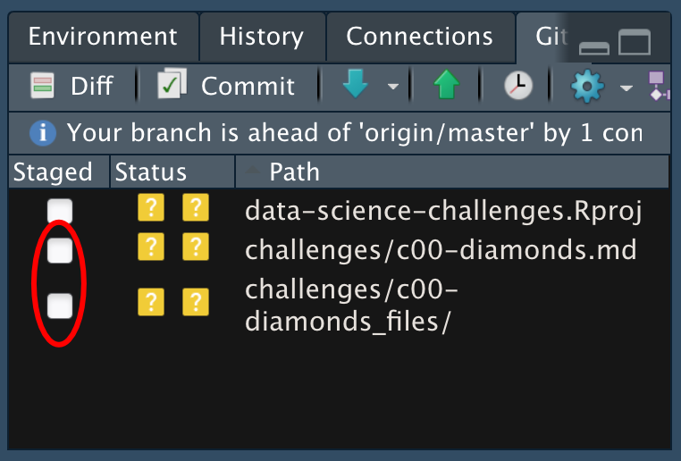

*Purpose*: Throughout this course, you'll complete a large number of *exercises* and *challenges*. Exercises are meant to introduce content with easy-to-solve problems, while challenges are meant to make you think more deeply about and apply the content. The challenges will start out highly-scaffolded, and become progressively open-ended.

In this challenge, you will go through the process of exploring, documenting, and sharing an analysis of a dataset. We will use these skills again and again in each challenge.

<!-- include-rubric -->
# Grading Rubric
<!-- -------------------------------------------------- -->

Unlike exercises, **challenges will be graded**. The following rubrics define how you will be graded, both on an individual and team basis.

## Individual
<!-- ------------------------- -->

| Category | Unsatisfactory | Satisfactory |
|----------|----------------|--------------|
| Effort | Some task __q__'s left unattempted | All task __q__'s attempted |
| Observed | Did not document observations | Documented observations based on analysis |
| Supported | Some observations not supported by analysis | All observations supported by analysis (table, graph, etc.) |
| Code Styled | Violations of the [style guide](https://style.tidyverse.org/) hinder readability | Code sufficiently close to the [style guide](https://style.tidyverse.org/) |

## Team
<!-- ------------------------- -->

| Category | Unsatisfactory | Satisfactory |
|----------|----------------|--------------|
| Documented | No team contributions to Wiki | Team contributed to Wiki |
| Referenced | No team references in Wiki | At least one reference in Wiki to member report(s) |
| Relevant | References unrelated to assertion, or difficult to find related analysis based on reference text | Reference text clearly points to relevant analysis |

## Due Date
<!-- ------------------------- -->

All the deliverables stated in the rubrics above are due on the day of the class discussion of that exercise. See the [Syllabus](https://docs.google.com/document/d/1jJTh2DH8nVJd2eyMMoyNGroReo0BKcJrz1eONi3rPSc/edit?usp=sharing) for more information.

```{r setup}
library(tidyverse)
```

# Data Exploration
<!-- -------------------------------------------------- -->

In this first stage, you will explore the `diamonds` dataset and document your observations.

__q1__ Create a plot of `price` vs `carat` of the `diamonds` dataset below. Document your observations from the visual.

*Hint*: We learned how to do this in `e-vis00-basics`!

```{r q1-task}
## TASK: Plot `price` vs `carat` below
## Your code here!
ggplot(data = diamonds) +
  geom_point(mapping = aes(x = carat, y = price))
```

**Observations**:

- (Write your observations here!)

__q2__ Create a visualization showing variables `carat`, `price`, and `cut` simultaneously. Experiment with which variable you assign to which aesthetic (`x`, `y`, etc.) to find an effective visual.

```{r q2-task}
## TASK: Plot `price`, `carat`, and `cut` below
## Your code here!
ggplot(data = diamonds) +
  geom_point(mapping = aes(x = carat, y = price, color = cut))
```

Hypotheses:
- Up through 1 carat, price scales linearly with carat. Past 1 carat, all bets are off. 

Observations:
- Linear more like up to 0.7-0.9 carats, depending on cut. And fair isn't linearly related at all.

How do I check if something is linear in R?

geom_smooth(method='lm', formula= y~x)

```{r q2-task}
## TASK: Plot `price`, `carat`, and `cut` below
diamonds %>% 
  filter(carat < 1) %>%
ggplot() +
  geom_smooth(mapping = aes(x = carat, y = price, color = cut), method='lm', formula= y~x) +
  geom_point(mapping = aes(x = carat, y = price, color = cut), alpha = 0.1)
```
```{r q2-task}
## TASK: Plot `price`, `carat`, and `cut` below
diamonds %>% 
  filter(carat < 1) %>%
ggplot() +
  geom_boxplot(mapping = aes(x = carat, y = price, color = cut))
```

```{r q2-task}
## TASK: Plot `price`, `carat`, and `cut` below
diamonds %>% 
ggplot() +
  geom_smooth(mapping = aes(x = carat, y = price, color = cut), method='lm', formula= y~x)
```

```{r q2-task}
## TASK: Plot `price`, `carat`, and `cut` below
## Your code here!
diamonds %>% 
  filter(carat < 1) %>%
ggplot() +
  geom_smooth(mapping = aes(x = carat, y = price, color = cut))
```
```{r}
diamonds %>% 
ggplot() +
  geom_smooth(mapping = aes(x = carat, y = price, color = cut))
```
Hypotheses:
- Most diamonds are small, and small diamonds are less pricey and have better color.
- Carat (weight) and volume are very closely linked.


```{r}
diamonds %>% 
  mutate(volume = x * y * z) %>%
  filter(volume < 500) %>%
ggplot() +
  geom_point(mapping = aes(x = volume, y = carat))
```
Why are there outliers? Why don't these correspond perfectly? Impurities? Seeing no correlation between outliers and a certain color or clarity.

```{r}
diamonds %>% 
    mutate(volume = x * y * z) %>%
  filter(volume < 500) %>%
ggplot() +
  geom_histogram(mapping = aes(x = volume), binwidth = 0.1)
```
```{r}
diamonds %>% 
ggplot() +
  geom_histogram(mapping = aes(x = carat), binwidth = 0.1)
```


```{r}
diamonds %>% 
  mutate(volume = x * y * z) %>%
  filter(volume < 500) %>%
ggplot() +
  geom_point(mapping = aes(x = volume, y = price, color = clarity))
```
```{r}
diamonds %>% 
  mutate(carat) %>%
ggplot() +
  geom_point(mapping = aes(x = carat, y = price, color = clarity))
```

Higher carat diamonds have higher minimum prices, but the maximum prices do not correlate with carat. They can be expensive at any size, but can't be cheap at any size.

With the same carat, better clarity diamonds fetch higher prices.

Large diamonds tend to have lower clarity.

**Observations**:
Volume and carat (weight) are very closely correlated, but there are outliers. I wonder if these are due to impurities. Outliers do not seem to correspond to worse color or lower clarity.

Higher carat diamonds have higher minimum prices, but the maximum prices do not correlate with carat. They can be expensive at any size, but can't be cheap at any size.

With the same carat, better clarity diamonds fetch higher prices.

Large diamonds tend to have lower clarity.

Up through 0.7 carat, price scales fairly linearly with carat, but after that they vary widely.

# Communication
<!-- -------------------------------------------------- -->

In this next stage, you will render your data exploration, push it to GitHub to share with others, and link your observations within our [Data Science Wiki](https://olin-data-science.fandom.com/wiki/Olin_Data_Science_Wiki).

__q3__ *Knit* your document in order to create a report.

You can do this by clicking the "Knit" button at the top of your document in RStudio.


This will create a local `.md` file, and RStudio will automatically open a preview window so you can view your knitted document.

__q4__ *Push* your knitted document to GitHub.



You will need to stage both the `.md` file, as well as the `_files` folder. Note that the `_files` folder, when staged, will expand to include all the files under that directory.


__q5__ *Document* your findings in our [Wiki](https://olin-data-science.fandom.com/wiki/Olin_Data_Science_Wiki). Work with your learning team to come to consensus on your findings.

The [Datasets](https://olin-data-science.fandom.com/wiki/Datasets) page contains lists all the datasets we've analyzed together.

__q6__ *Prepare* to present your team's findings!

__q7__ Add a link to your personal data-science repository on the [Repositories](https://olin-data-science.fandom.com/wiki/Repositories) page. Make sure to file it under your team name!
