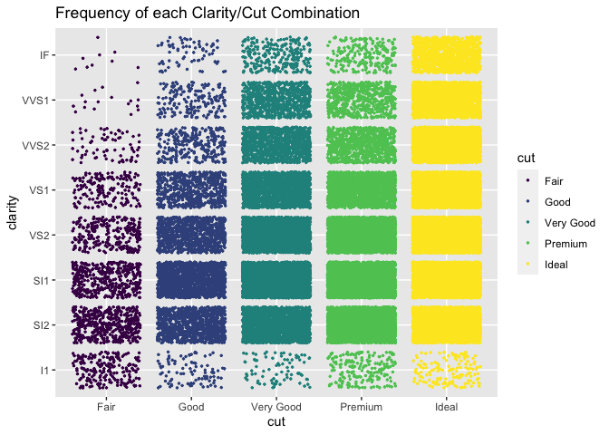

Getting Started: Diamonds
================
Charlie Farison
2020-07-11

  - [Grading Rubric](#grading-rubric)
      - [Individual](#individual)
      - [Team](#team)
      - [Due Date](#due-date)
  - [Data Exploration](#data-exploration)
  - [Communication](#communication)

*Purpose*: Throughout this course, you’ll complete a large number of
*exercises* and *challenges*. Exercises are meant to introduce content
with easy-to-solve problems, while challenges are meant to make you
think more deeply about and apply the content. The challenges will start
out highly-scaffolded, and become progressively open-ended.

In this challenge, you will go through the process of exploring,
documenting, and sharing an analysis of a dataset. We will use these
skills again and again in each challenge.

<!-- include-rubric -->

# Grading Rubric

<!-- -------------------------------------------------- -->

Unlike exercises, **challenges will be graded**. The following rubrics
define how you will be graded, both on an individual and team basis.

## Individual

<!-- ------------------------- -->

| Category    | Unsatisfactory                                                                   | Satisfactory                                                               |
| ----------- | -------------------------------------------------------------------------------- | -------------------------------------------------------------------------- |
| Effort      | Some task **q**’s left unattempted                                               | All task **q**’s attempted                                                 |
| Observed    | Did not document observations                                                    | Documented observations based on analysis                                  |
| Supported   | Some observations not supported by analysis                                      | All observations supported by analysis (table, graph, etc.)                |
| Code Styled | Violations of the [style guide](https://style.tidyverse.org/) hinder readability | Code sufficiently close to the [style guide](https://style.tidyverse.org/) |

## Team

<!-- ------------------------- -->

| Category   | Unsatisfactory                                                                                   | Satisfactory                                       |
| ---------- | ------------------------------------------------------------------------------------------------ | -------------------------------------------------- |
| Documented | No team contributions to Wiki                                                                    | Team contributed to Wiki                           |
| Referenced | No team references in Wiki                                                                       | At least one reference in Wiki to member report(s) |
| Relevant   | References unrelated to assertion, or difficult to find related analysis based on reference text | Reference text clearly points to relevant analysis |

## Due Date

<!-- ------------------------- -->

All the deliverables stated in the rubrics above are due on the day of
the class discussion of that exercise. See the
[Syllabus](https://docs.google.com/document/d/1jJTh2DH8nVJd2eyMMoyNGroReo0BKcJrz1eONi3rPSc/edit?usp=sharing)
for more information.

# Data Exploration

<!-- -------------------------------------------------- -->

In this first stage, you will explore the `diamonds` dataset and
document your observations.

**q1** Create a plot of `price` vs `carat` of the `diamonds` dataset
below. Document your observations from the visual.

*Hint*: We learned how to do this in `e-vis00-basics`\!

``` r
ggplot(data = diamonds) +
  geom_point(mapping = aes(x = carat, y = price)) +
  ggtitle("Price vs Carat")
```

<!-- -->

**Observations**:

  - From 0 to 1 carat, price seems to be clearly positively correlated
    with carat.
  - Past 1 carat, diamond prices can be very high, so there are likely
    other key factors that contribute to price.
  - The minimum price for a diamond seems to increase based on carat,
    but the maximum price does not (past 1 carat).

**q2** Create a visualization showing variables `carat`, `price`, and
`cut` simultaneously. Experiment with which variable you assign to which
aesthetic (`x`, `y`, etc.) to find an effective visual.

``` r
diamonds %>%
  ggplot() +
  geom_point(mapping = aes(x = carat, y = price, color = cut)) +
  ggtitle("Price vs Carat, with color as Cut")
```

<!-- -->

**Observations**:

With the same carat, poor cut diamonds tend to fetch lower prices.
However, many ideal cut diamonds still fetch low prices, which can be
seen more clearly in this zoomed in version of the graph.

``` r
diamonds %>%
  filter(carat < 1) %>%
  ggplot() +
  geom_point(mapping = aes(x = carat, y = price, color = cut)) +
  ggtitle("Price vs Carat, with color as Cut, for Carat < 1")
```

<!-- -->

With the same carat, better clarity diamonds tend to fetch higher
prices. Larger diamonds tend to have lower clarity, but can still fetch
high prices.

``` r
diamonds %>% 
ggplot() +
  geom_point(mapping = aes(x = carat, y = price, color = clarity)) +
  ggtitle("Price vs Carat, with color as Clarity")
```

<!-- -->

Diamond color looks to be more strongly correlated with carat (better
color for lower carat) than with price.

``` r
diamonds %>% 
ggplot() +
  geom_point(mapping = aes(x = carat, y = price, color = color)) +
  ggtitle("Price vs Carat, with color as Color")
```

<!-- -->

Most diamonds are less than 1.5 carats, so the sample size is smaller
for diamonds larger than 1.5 carats and it is harder to draw
conclusions. The 3rd quartile is 1.04, but the max is 5.01.

Ideal cut diamonds are the most common in this data set, with a high
number of premium and very good as well.

Most diamonds are in the top two clarity buckets.

``` r
summary(diamonds)
```

    ##      carat               cut        color        clarity          depth      
    ##  Min.   :0.2000   Fair     : 1610   D: 6775   SI1    :13065   Min.   :43.00  
    ##  1st Qu.:0.4000   Good     : 4906   E: 9797   VS2    :12258   1st Qu.:61.00  
    ##  Median :0.7000   Very Good:12082   F: 9542   SI2    : 9194   Median :61.80  
    ##  Mean   :0.7979   Premium  :13791   G:11292   VS1    : 8171   Mean   :61.75  
    ##  3rd Qu.:1.0400   Ideal    :21551   H: 8304   VVS2   : 5066   3rd Qu.:62.50  
    ##  Max.   :5.0100                     I: 5422   VVS1   : 3655   Max.   :79.00  
    ##                                     J: 2808   (Other): 2531                  
    ##      table           price             x                y         
    ##  Min.   :43.00   Min.   :  326   Min.   : 0.000   Min.   : 0.000  
    ##  1st Qu.:56.00   1st Qu.:  950   1st Qu.: 4.710   1st Qu.: 4.720  
    ##  Median :57.00   Median : 2401   Median : 5.700   Median : 5.710  
    ##  Mean   :57.46   Mean   : 3933   Mean   : 5.731   Mean   : 5.735  
    ##  3rd Qu.:59.00   3rd Qu.: 5324   3rd Qu.: 6.540   3rd Qu.: 6.540  
    ##  Max.   :95.00   Max.   :18823   Max.   :10.740   Max.   :58.900  
    ##                                                                   
    ##        z         
    ##  Min.   : 0.000  
    ##  1st Qu.: 2.910  
    ##  Median : 3.530  
    ##  Mean   : 3.539  
    ##  3rd Qu.: 4.040  
    ##  Max.   :31.800  
    ## 

Since both better cut and better clarity seem to be correlated with
higher price, I wonder if cut and clarity are correlated. It looks like
most of the best clarity diamonds also have ideal cut, but poor clarity
diamonds are distributed fairly evenly across different cuts. So better
cut and better clarity seem to be correlated for the best diamonds, but
not for worse diamonds.

``` r
ggplot(diamonds, aes(cut, clarity)) +
  geom_jitter(aes(color = cut), size = 0.5) +
  ggtitle("Frequency of each Clarity/Cut Combination")
```

<!-- -->

How does price vary for the best cut diamonds? For the best cut
diamonds, price increases with carat, and the higher clarity diamonds
tend to fetch higher prices for a given carat.

``` r
diamonds %>%
  filter(cut == "Ideal") %>%
  ggplot() +
  geom_point(mapping = aes(x = carat, y = price, color = clarity)) +
  ggtitle("Price vs Carat for Ideal Cut only")
```

<!-- -->

Carat seems to be the variable most strongly correlated with price.
Color does not seem to be correlated with price. Cut and clarity both
seem to be somewhat correlated with price. I wonder which variable is
more important to price, cut or clarity, but I’m not sure yet how to
answer this question.

# Communication

<!-- -------------------------------------------------- -->

In this next stage, you will render your data exploration, push it to
GitHub to share with others, and link your observations within our [Data
Science
Wiki](https://olin-data-science.fandom.com/wiki/Olin_Data_Science_Wiki).

**q3** *Knit* your document in order to create a report.

You can do this by clicking the “Knit” button at the top of your
document in RStudio.


This will create a local `.md` file, and RStudio will automatically open
a preview window so you can view your knitted document.

**q4** *Push* your knitted document to GitHub.


You will need to stage both the `.md` file, as well as the `_files`
folder. Note that the `_files` folder, when staged, will expand to
include all the files under that directory.


**q5** *Document* your findings in our
[Wiki](https://olin-data-science.fandom.com/wiki/Olin_Data_Science_Wiki).
Work with your learning team to come to consensus on your findings.

The [Datasets](https://olin-data-science.fandom.com/wiki/Datasets) page
contains lists all the datasets we’ve analyzed together.

**q6** *Prepare* to present your team’s findings\!

**q7** Add a link to your personal data-science repository on the
[Repositories](https://olin-data-science.fandom.com/wiki/Repositories)
page. Make sure to file it under your team name\!
