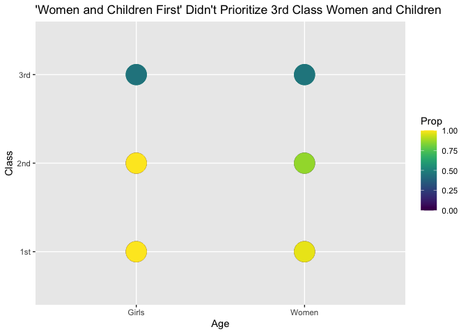

RMS Titanic
================
Charlie Farison
2020-07-14

  - [Grading Rubric](#grading-rubric)
      - [Individual](#individual)
      - [Team](#team)
      - [Due Date](#due-date)
  - [First Look](#first-look)
  - [Deeper Look](#deeper-look)
  - [Could calculate total, look at proportion of
    total.](#could-calculate-total-look-at-proportion-of-total.)
  - [Notes](#notes)

*Purpose*: Most datasets have at least a few variables. Part of our task
in analyzing a dataset is to understand trends as they vary across these
different variables. Unless we’re careful and thorough, we can easily
miss these patterns. In this challenge you’ll analyze a dataset with a
small number of categorical variables and try to find differences among
the groups.

*Reading*: (Optional) [Wikipedia
article](https://en.wikipedia.org/wiki/RMS_Titanic) on the RMS Titanic.

<!-- include-rubric -->

# Grading Rubric

<!-- -------------------------------------------------- -->

Unlike exercises, **challenges will be graded**. The following rubrics
define how you will be graded, both on an individual and team basis.

## Individual

<!-- ------------------------- -->

| Category    | Unsatisfactory                                                                   | Satisfactory                                                               |
| ----------- | -------------------------------------------------------------------------------- | -------------------------------------------------------------------------- |
| Effort      | Some task **q**’s left unattempted                                               | All task **q**’s attempted                                                 |
| Observed    | Did not document observations                                                    | Documented observations based on analysis                                  |
| Supported   | Some observations not supported by analysis                                      | All observations supported by analysis (table, graph, etc.)                |
| Code Styled | Violations of the [style guide](https://style.tidyverse.org/) hinder readability | Code sufficiently close to the [style guide](https://style.tidyverse.org/) |

## Team

<!-- ------------------------- -->

| Category   | Unsatisfactory                                                                                   | Satisfactory                                       |
| ---------- | ------------------------------------------------------------------------------------------------ | -------------------------------------------------- |
| Documented | No team contributions to Wiki                                                                    | Team contributed to Wiki                           |
| Referenced | No team references in Wiki                                                                       | At least one reference in Wiki to member report(s) |
| Relevant   | References unrelated to assertion, or difficult to find related analysis based on reference text | Reference text clearly points to relevant analysis |

## Due Date

<!-- ------------------------- -->

All the deliverables stated in the rubrics above are due on the day of
the class discussion of that exercise. See the
[Syllabus](https://docs.google.com/document/d/1jJTh2DH8nVJd2eyMMoyNGroReo0BKcJrz1eONi3rPSc/edit?usp=sharing)
for more information.

*Background*: The RMS Titanic sank on its maiden voyage in 1912; about
67% of its passengers died.

# First Look

<!-- -------------------------------------------------- -->

**q1** Perform a glimpse of `df_titanic`. What variables are in this
dataset?

``` r
glimpse(df_titanic)
```

    ## Rows: 32
    ## Columns: 5
    ## $ Class    <chr> "1st", "2nd", "3rd", "Crew", "1st", "2nd", "3rd", "Crew", "1…
    ## $ Sex      <chr> "Male", "Male", "Male", "Male", "Female", "Female", "Female"…
    ## $ Age      <chr> "Child", "Child", "Child", "Child", "Child", "Child", "Child…
    ## $ Survived <chr> "No", "No", "No", "No", "No", "No", "No", "No", "No", "No", …
    ## $ n        <dbl> 0, 0, 35, 0, 0, 0, 17, 0, 118, 154, 387, 670, 4, 13, 89, 3, …

**Observations**:

Variables:

  - Class (string)
  - Sex (string)
  - Age (string)
  - Survived (string)
  - n (number)

This data set is different from others I’ve analyzed, in that instead of
one row per individual, it has one row showing a count of individuals
that meet a set of categories.

**q2** Skim the [Wikipedia
article](https://en.wikipedia.org/wiki/RMS_Titanic) on the RMS Titanic,
and look for a total count of passengers. Compare against the total
computed below. Are there any differences? Are those differences large
or small? What might account for those differences?

``` r
## NOTE: No need to edit! We'll cover how to
## do this calculation in a later exercise.
df_titanic %>% summarize(total = sum(n))
```

    ## # A tibble: 1 x 1
    ##   total
    ##   <dbl>
    ## 1  2201

**Observations**:

Wikipedia estimates 2224 total passengers. This dataset has 2201.
Perhaps not all crew members were documented well, since they would not
have needed to purchase tickets.

**q3** Create a plot showing the count of passengers who *did* survive,
along with aesthetics for `Class` and `Sex`. Document your observations
below.

*Note*: There are many ways to do this.

``` r
df_titanic %>%
  filter(Survived == "Yes") %>%
  ggplot() +
  geom_point(mapping = aes(x = Sex, y = Class, size = n)) +
  scale_size_area(max_size = 10) +
  ggtitle("Survivors Mostly Male Crew Members")
```

<!-- -->

``` r
df_titanic %>%
  filter(Survived == "Yes") %>%
  ggplot() +
    geom_col(aes(x = Sex, y = n, fill = Class))
```

<!-- -->

**Observations**:

  - The largest number of survivors were male crew members, but that’s
    possibly because they made up a large number of the proportion of
    total ship passengers. Next I will assess the proportions of
    different groups among total passengers.
  - The second largest number of survivors were female 1st class
    passengers, which may mean a very high proportion of them survived.

<!-- end list -->

``` r
df_titanic %>%
  ggplot() +
  geom_point(mapping = aes(x = Sex, y = Class, size = n)) +
  scale_size_area(max_size = 10) +
  ggtitle("Total Passengers Predominantly Male Crew and 3rd Class")
```

<!-- -->

**Observations**:

  - Overall, passengers were predominantly male crew and male 3rd class
    passengers, which helps explain why so many male crew survived.

# Deeper Look

<!-- -------------------------------------------------- -->

Raw counts give us a sense of totals, but they are not as useful for
understanding differences between groups. This is because the
differences we see in counts could be due to either the relative size of
the group OR differences in outcomes for those groups. To make
comparisons between groups, we should also consider *proportions*.\[1\]

The following code computes proportions within each `Class, Sex, Age`
group.

``` r
## NOTE: No need to edit! We'll cover how to
## do this calculation in a later exercise.
df_prop <-
  df_titanic %>%
  group_by(Class, Sex, Age) %>%
  mutate(
    Total = sum(n),
    Prop = n / Total
  ) %>%
  ungroup()
df_prop
```

    ## # A tibble: 32 x 7
    ##    Class Sex    Age   Survived     n Total    Prop
    ##    <chr> <chr>  <chr> <chr>    <dbl> <dbl>   <dbl>
    ##  1 1st   Male   Child No           0     5   0    
    ##  2 2nd   Male   Child No           0    11   0    
    ##  3 3rd   Male   Child No          35    48   0.729
    ##  4 Crew  Male   Child No           0     0 NaN    
    ##  5 1st   Female Child No           0     1   0    
    ##  6 2nd   Female Child No           0    13   0    
    ##  7 3rd   Female Child No          17    31   0.548
    ##  8 Crew  Female Child No           0     0 NaN    
    ##  9 1st   Male   Adult No         118   175   0.674
    ## 10 2nd   Male   Adult No         154   168   0.917
    ## # … with 22 more rows

**q4** Replicate your visual from q3, but display `Prop` in place of
`n`. Document your observations, and note any new/different observations
you make in comparison with q3.

``` r
df_prop %>%
  filter(Survived == "Yes") %>%
  ggplot() +
  geom_point(mapping = aes(x = Sex, y = Class, color = Prop), size = 10) +
  scale_size_area(max_size = 10) +
  scale_color_viridis() +
  ggtitle("Male Crew and 3rd Class Least Likely to Survive")
```

<!-- -->

**Observations**:

  - Male crew and overall 3rd class passengers were least likely to
    survive, closely followed by male 2nd class passengers.
  - 1st class female passengers were most likely to survive, followed by
    2nd class female passengers and female crew.
  - 3rd class women were much less likely to survive than 1st and 2nd
    class women.

**q5** Create a plot showing the group-proportion of passengers who
*did* survive, along with aesthetics for `Class`, `Sex`, *and* `Age`.
Document your observations below.

*Hint*: Don’t forget that you can use `facet_grid` to help consider
additional variables\!

``` r
df_prop %>%
  ggplot() +
  geom_point(mapping = aes(x = Sex, y = Class, color = Prop), size = 10) +
  scale_color_viridis() +
  facet_wrap(~Age) +
  ggtitle("Children's Safety Prioritized, with 1st Class Women Accompanying Them")
```

<!-- -->

**Observations**:

  - Children’s survival was clearly prioritized, followed closely by 1st
    class women, who presumably accompanied the children in the
    lifeboats.
  - 1st class men were much less likely to survive than 1st class women
    and 1st and 2nd class children. The chart below shows this claim
    more clearly.

<!-- end list -->

``` r
df_prop %>%
  filter(Class == "1st") %>%
  ggplot() +
  geom_point(mapping = aes(x = Age, y = Sex, color = Prop), size = 10) +
  scale_color_viridis() +
  ggtitle("Male First Class Adults Less Likely to Survive than Children")
```

<!-- -->

``` r
df_prop %>%
  filter(Sex == "Female") %>%
  filter (Class != "Crew") %>%
  mutate(Age = ifelse(Age == "Adult", "Women", "Girls")) %>%
  ggplot() +
  geom_point(mapping = aes(x = Age, y = Class, color = Prop), size = 10) +
  scale_color_viridis() +
  ggtitle("Women and Children First Didn't Prioritize 3rd Class Women")
```

<!-- -->

3rd class women survived much less well than 1st and 2nd class women and
children.

# Could calculate total, look at proportion of total.

# Notes

<!-- -------------------------------------------------- -->

\[1\] This is basically the same idea as [Dimensional
Analysis](https://en.wikipedia.org/wiki/Dimensional_analysis); computing
proportions is akin to non-dimensionalizing a quantity.
