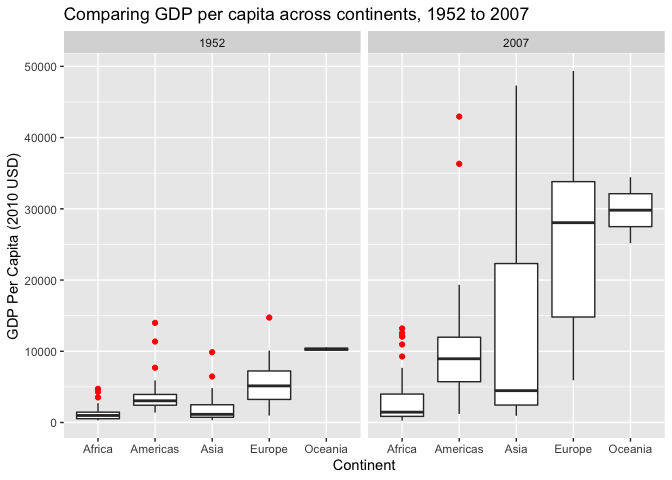
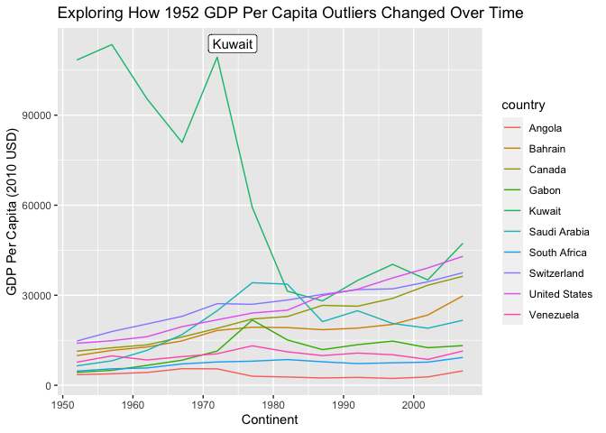
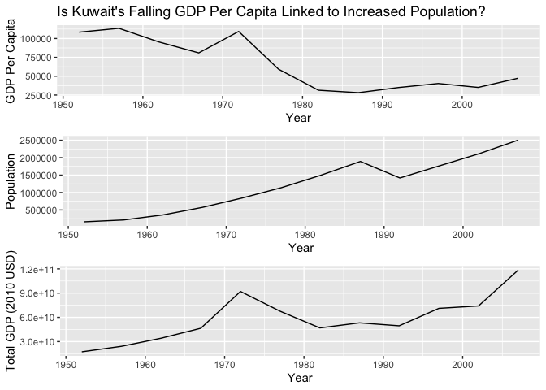

Gapminder
================
Charlie Farison
2020-7-25

  - [Grading Rubric](#grading-rubric)
      - [Individual](#individual)
      - [Team](#team)
      - [Due Date](#due-date)
  - [Guided EDA](#guided-eda)
  - [Your Own EDA](#your-own-eda)

*Purpose*: Learning to do EDA well takes practice\! In this challenge
you’ll further practice EDA by first completing a guided exploration,
then by conducting your own investigation. This challenge will also give
you a chance to use the wide variety of visual tools we’ve been
learning.

<!-- include-rubric -->

# Grading Rubric

<!-- -------------------------------------------------- -->

Unlike exercises, **challenges will be graded**. The following rubrics
define how you will be graded, both on an individual and team basis.

## Individual

<!-- ------------------------- -->

| Category    | Unsatisfactory                                                                   | Satisfactory                                                               |
| ----------- | -------------------------------------------------------------------------------- | -------------------------------------------------------------------------- |
| Effort      | Some task **q**’s left unattempted                                               | All task **q**’s attempted                                                 |
| Observed    | Did not document observations                                                    | Documented observations based on analysis                                  |
| Supported   | Some observations not supported by analysis                                      | All observations supported by analysis (table, graph, etc.)                |
| Code Styled | Violations of the [style guide](https://style.tidyverse.org/) hinder readability | Code sufficiently close to the [style guide](https://style.tidyverse.org/) |

## Team

<!-- ------------------------- -->

| Category   | Unsatisfactory                                                                                   | Satisfactory                                       |
| ---------- | ------------------------------------------------------------------------------------------------ | -------------------------------------------------- |
| Documented | No team contributions to Wiki                                                                    | Team contributed to Wiki                           |
| Referenced | No team references in Wiki                                                                       | At least one reference in Wiki to member report(s) |
| Relevant   | References unrelated to assertion, or difficult to find related analysis based on reference text | Reference text clearly points to relevant analysis |

## Due Date

<!-- ------------------------- -->

All the deliverables stated in the rubrics above are due on the day of
the class discussion of that exercise. See the
[Syllabus](https://docs.google.com/document/d/1jJTh2DH8nVJd2eyMMoyNGroReo0BKcJrz1eONi3rPSc/edit?usp=sharing)
for more information.

``` r
library(tidyverse)
```

    ## ── Attaching packages ────────────────────────────────────────────────────────── tidyverse 1.3.0 ──

    ## ✓ ggplot2 3.3.2     ✓ purrr   0.3.4
    ## ✓ tibble  3.0.1     ✓ dplyr   1.0.0
    ## ✓ tidyr   1.1.0     ✓ stringr 1.4.0
    ## ✓ readr   1.3.1     ✓ forcats 0.5.0

    ## ── Conflicts ───────────────────────────────────────────────────────────── tidyverse_conflicts() ──
    ## x dplyr::filter() masks stats::filter()
    ## x dplyr::lag()    masks stats::lag()

``` r
library(gapminder)
```

*Background*: [Gapminder](https://www.gapminder.org/about-gapminder/) is
an independent organization that seeks to education people about the
state of the world. They promote a “fact-based worldview” by focusing on
data. The dataset we’ll study in this challenge is from Gapminder.

# Guided EDA

<!-- -------------------------------------------------- -->

First, we’ll go through a round of *guided EDA*. Try to pay attention to
the high-level process we’re going through—after this guided round
you’ll be responsible for doing another cycle of EDA on your own\!

**q0** Perform your “first checks” on the dataset. What variables are in
this dataset?

``` r
## TASK: Do your "first checks" here!
glimpse(gapminder)
```

    ## Rows: 1,704
    ## Columns: 6
    ## $ country   <fct> Afghanistan, Afghanistan, Afghanistan, Afghanistan, Afghani…
    ## $ continent <fct> Asia, Asia, Asia, Asia, Asia, Asia, Asia, Asia, Asia, Asia,…
    ## $ year      <int> 1952, 1957, 1962, 1967, 1972, 1977, 1982, 1987, 1992, 1997,…
    ## $ lifeExp   <dbl> 28.801, 30.332, 31.997, 34.020, 36.088, 38.438, 39.854, 40.…
    ## $ pop       <int> 8425333, 9240934, 10267083, 11537966, 13079460, 14880372, 1…
    ## $ gdpPercap <dbl> 779.4453, 820.8530, 853.1007, 836.1971, 739.9811, 786.1134,…

``` r
summary(gapminder)
```

    ##         country        continent        year         lifeExp     
    ##  Afghanistan:  12   Africa  :624   Min.   :1952   Min.   :23.60  
    ##  Albania    :  12   Americas:300   1st Qu.:1966   1st Qu.:48.20  
    ##  Algeria    :  12   Asia    :396   Median :1980   Median :60.71  
    ##  Angola     :  12   Europe  :360   Mean   :1980   Mean   :59.47  
    ##  Argentina  :  12   Oceania : 24   3rd Qu.:1993   3rd Qu.:70.85  
    ##  Australia  :  12                  Max.   :2007   Max.   :82.60  
    ##  (Other)    :1632                                                
    ##       pop              gdpPercap       
    ##  Min.   :6.001e+04   Min.   :   241.2  
    ##  1st Qu.:2.794e+06   1st Qu.:  1202.1  
    ##  Median :7.024e+06   Median :  3531.8  
    ##  Mean   :2.960e+07   Mean   :  7215.3  
    ##  3rd Qu.:1.959e+07   3rd Qu.:  9325.5  
    ##  Max.   :1.319e+09   Max.   :113523.1  
    ## 

**Observations**:

This dataset has the following variables:

  - country (fct)
  - continent (fct)
  - year (int)
  - lifeExp (dbl): life expectancy in years
  - pop (int): population
  - gdpPercap (dbl): GDP per capita (US dollars)

**q1** Determine the most and least recent years in the `gapminder`
dataset.

``` r
## TASK: Find the largest and smallest values of `year` in `gapminder`
year_max <- gapminder %>%
  summarise(year_max = max(year))
year_max
```

    ## # A tibble: 1 x 1
    ##   year_max
    ##      <int>
    ## 1     2007

``` r
year_min <- gapminder %>%
  summarise(year_min = min(year))
year_min
```

    ## # A tibble: 1 x 1
    ##   year_min
    ##      <int>
    ## 1     1952

Use the following test to check your work.

``` r
## NOTE: No need to change this
assertthat::assert_that(year_max %% 7 == 5)
```

    ## [1] TRUE

``` r
assertthat::assert_that(year_max %% 3 == 0)
```

    ## [1] TRUE

``` r
assertthat::assert_that(year_min %% 7 == 6)
```

    ## [1] TRUE

``` r
assertthat::assert_that(year_min %% 3 == 2)
```

    ## [1] TRUE

``` r
print("Nice!")
```

    ## [1] "Nice!"

**q2** Filter on years matching `year_min`, and make a plot of the GDE
per capita against continent. Choose an appropriate `geom_` to visualize
the data. What observations can you make?

You may encounter difficulties in visualizing these data; if so document
your challenges and attempt to produce the most informative visual you
can.

``` r
#I found that using the result from above as min_year did not actually succeed in filtering by min_year, so I converted it to an integer rather than a data frame.
year_min_list = as.list(year_min)
year_min = year_min_list[1]
year_max_list = as.list(year_max)
year_max = year_max_list[1]
year_min
```

    ## $year_min
    ## [1] 1952

``` r
year_max
```

    ## $year_max
    ## [1] 2007

``` r
## TASK: Create a visual of gdpPercap vs continent
gapminder %>%
  filter(year == year_min) %>%
  filter(gdpPercap < 90000) %>% #removing 1 outlier that made it hard to visualize
  ggplot() +
  geom_boxplot(mapping = aes(continent, gdpPercap))
```

<!-- -->

``` r
#Determining which country the outlier is
gapminder %>%
  filter(year == year_min) %>%
  filter(gdpPercap > 90000)
```

    ## # A tibble: 1 x 6
    ##   country continent  year lifeExp    pop gdpPercap
    ##   <fct>   <fct>     <int>   <dbl>  <int>     <dbl>
    ## 1 Kuwait  Asia       1952    55.6 160000   108382.

``` r
#Determining # of countries per continent in this dataset in 1952
gapminder %>%
  filter(year == year_min) %>%
  summary()
```

    ##         country       continent       year         lifeExp     
    ##  Afghanistan:  1   Africa  :52   Min.   :1952   Min.   :28.80  
    ##  Albania    :  1   Americas:25   1st Qu.:1952   1st Qu.:39.06  
    ##  Algeria    :  1   Asia    :33   Median :1952   Median :45.14  
    ##  Angola     :  1   Europe  :30   Mean   :1952   Mean   :49.06  
    ##  Argentina  :  1   Oceania : 2   3rd Qu.:1952   3rd Qu.:59.77  
    ##  Australia  :  1                 Max.   :1952   Max.   :72.67  
    ##  (Other)    :136                                               
    ##       pop              gdpPercap       
    ##  Min.   :    60011   Min.   :   298.9  
    ##  1st Qu.:  1452026   1st Qu.:   864.8  
    ##  Median :  3943953   Median :  1968.5  
    ##  Mean   : 16950402   Mean   :  3725.3  
    ##  3rd Qu.:  9168198   3rd Qu.:  3913.5  
    ##  Max.   :556263527   Max.   :108382.4  
    ## 

**Observations**:

  - Kuwait’s GDP per capita is so high that including it makes it hard
    to visualize the rest of the data, so I removed it. Kuwait’s GDP per
    capita is 108,382.4.
  - Oceania has a high median GDP per capita, but also has a small
    sample size. In 1952, Oceania only had 2 countries, while the other
    continents had between 25 and 52 countries.
  - Africa and Asia have similar medians, but Asia has a higher 3rd
    quartile and maximum.
  - Europe has the widest range of all the continents by far.

**Difficulties & Approaches**:

  - Kuwait’s GDP per capita is so high that including it makes it hard
    to visualize the rest of the data, so I removed it. Kuwait’s GDP per
    capita is 108,382.4. I removed Kuwait from the data set in order to
    be able to make effective boxplots.
  - Overall there are several outliers, but the boxplot by continent
    makes it easy to visualize this without impacting the observations
    from the data.

**q3** You should have found at least three outliers in q2. Identify
those outliers (figure out which countries they are).

*Note*: I realize the reasons for

``` r
## TASK: Identify the outliers from q2
gapminder %>%
  filter(year == year_min, continent == "Africa", gdpPercap > 3000)
```

    ## # A tibble: 3 x 6
    ##   country      continent  year lifeExp      pop gdpPercap
    ##   <fct>        <fct>     <int>   <dbl>    <int>     <dbl>
    ## 1 Angola       Africa     1952    30.0  4232095     3521.
    ## 2 Gabon        Africa     1952    37.0   420702     4293.
    ## 3 South Africa Africa     1952    45.0 14264935     4725.

``` r
gapminder %>%
  filter(year == year_min, continent == "Americas", gdpPercap > 7500)
```

    ## # A tibble: 3 x 6
    ##   country       continent  year lifeExp       pop gdpPercap
    ##   <fct>         <fct>     <int>   <dbl>     <int>     <dbl>
    ## 1 Canada        Americas   1952    68.8  14785584    11367.
    ## 2 United States Americas   1952    68.4 157553000    13990.
    ## 3 Venezuela     Americas   1952    55.1   5439568     7690.

``` r
gapminder %>%
  filter(year == year_min, continent == "Asia", gdpPercap > 5000)
```

    ## # A tibble: 3 x 6
    ##   country      continent  year lifeExp     pop gdpPercap
    ##   <fct>        <fct>     <int>   <dbl>   <int>     <dbl>
    ## 1 Bahrain      Asia       1952    50.9  120447     9867.
    ## 2 Kuwait       Asia       1952    55.6  160000   108382.
    ## 3 Saudi Arabia Asia       1952    39.9 4005677     6460.

``` r
gapminder %>%
  filter(year == year_min, continent == "Europe", gdpPercap > 13000)
```

    ## # A tibble: 1 x 6
    ##   country     continent  year lifeExp     pop gdpPercap
    ##   <fct>       <fct>     <int>   <dbl>   <int>     <dbl>
    ## 1 Switzerland Europe     1952    69.6 4815000    14734.

**Observations**:

  - Africa: Angola (3520), Gabon (4293), South Africa (4725)
  - Americas: Canada (11367), United States (13990), Venezuela (7689)
  - Asia: Bahrain (9867), Kuwait (108382), Saudi Arabia (6459)
  - Europe: Switzerland (14734)

**q4** Create a plot similar to yours from q2 studying both `year_min`
and `year_max`. Find a way to highlight the outliers from q3 on your
plot. Compare the patterns between `year_min` and `year_max`.

*Hint*: We’ve learned a lot of different ways to show multiple
variables; think about using different aesthetics or facets.

``` r
## TASK: Create a visual of gdpPercap vs continent
gapminder %>%
  filter(year == year_min | year == year_max) %>%
  filter(gdpPercap < 90000) %>% #removing 1 outlier that made it hard to visualize
  ggplot() +
  geom_boxplot(mapping = aes(continent, gdpPercap), outlier.colour = "red") +
  facet_wrap(~year)
```

<!-- -->

**Observations**:

  - Most of the medians have increased, with Europe and Oceania as the
    highest increases.

# Your Own EDA

<!-- -------------------------------------------------- -->

Now it’s your turn\! We just went through guided EDA considering the GDP
per capita at two time points. You can continue looking at outliers,
consider different years, repeat the exercise with `lifeExp`, consider
the relationship between variables, or something else entirely.

**q5** Create *at least* three new figures below. With each figure, try
to pose new questions about the data.

``` r
## TASK: Your first graph
#Were the outliers always outliers?
gapminder %>%
  filter(
    country %in% c("Kuwait", "United States", "Angola", "Gabon", 
                   "South Africa", "Canada", "Venezuela", "Bahrain",
                   "Saudi Arabia", "Switzerland")) %>%
  ggplot() +
  geom_line(mapping = aes(x = year, y = gdpPercap, color = country))
```

<!-- -->

**Observations**

  - Question: Do we see anything weird if we look at outliers from 1952
    and how their GDP per capita changed over time?
  - Kuwait actually dropped a lot, maybe because this number is per
    capita and their population grew.

<!-- end list -->

``` r
## TASK: Your second graph
gapminder %>%
  filter(country == "Kuwait") %>%
  mutate(gdp = gdpPercap * pop) %>%
  ggplot() +
  geom_line(mapping = aes(x = year, y = gdp)) +
  geom_vline(xintercept = 1972, color = "red")
```

<!-- -->

**Observations**

  - Question: Did Kuwait’s GDP per capita drop so much because its
    population changed a lot?
  - After multiplying GDP by population to show the total GDP, there is
    still a sharp drop in GDP around 1972.
  - I found an article that said “The main shocks that have affected the
    Kuwaiti economy since 1970 have been due to developments in the
    international oil markets (the oil shock of 1973/74, see Mohaddes
    (2013) for more details), the Iran-Iraq war (1980-1988), the
    domestic stock market crisis (Souk Al-Manakh, 1983), Iraqi invasion
    of Kuwait (August 1990), oil price crash (early 1990s), and global
    Önancial crisis (2007).”
  - Article:
    <http://www.econ.cam.ac.uk/people-files/faculty/km418/Macroeconometric_Model_for_Kuwait.pdf>
  - However, this data primarily shows a drop that starts in 1972 and
    lasts through 1982, so it doesn’t quite line up.

<!-- end list -->

``` r
## TASK: Your third graph
gapminder %>%
  filter(continent == "Asia") %>%
  ggplot() +
  geom_line(mapping = aes(x = year, y = pop, color = country))
```

<!-- -->

**Observations**

  - Question: In which Asian countries did population grow the most from
    1952 to 2007?
  - If we’re looking at number of people increase, the answer is China
    and India.

<!-- end list -->

``` r
## TASK: Create a visual of gdpPercap vs continent
library(ggrepel)
gapminder %>%
  filter(year == year_min | year == year_max) %>%
  filter(country %in% c("United States", "Angola", "Gabon", 
                   "South Africa", "Canada", "Venezuela", "Bahrain",
                   "Saudi Arabia", "Switzerland")) %>%
  ggplot() +
  geom_label_repel(mapping = aes(continent, gdpPercap, label = country)) +
  facet_wrap(~year)
```

<!-- -->

**Observations**

  - Question: How did the outliers from 1952 change relative to one
    another over time?
  - The US and Switzerland were on top in 1952, and in 2007 tne United
    States is still on top, but Canada has surpassed Switzerland.
  - Saudi Arabia grew to surpass South Africa and Gabon.
