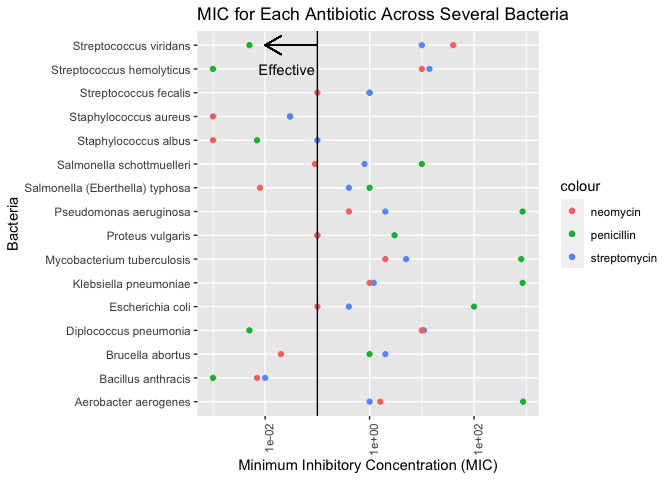
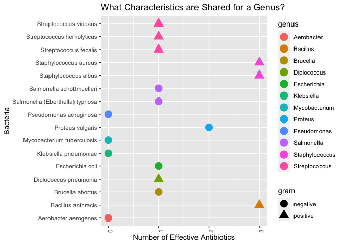

Antibiotics
================
Charlie Farison
2020-7-30

  - [Grading Rubric](#grading-rubric)
      - [Individual](#individual)
      - [Team](#team)
      - [Due Date](#due-date)
  - [Visualization](#visualization)
      - [Purpose: Compare Effectiveness](#purpose-compare-effectiveness)
      - [Purpose: Categorize Bacteria](#purpose-categorize-bacteria)
  - [References](#references)

*Purpose*: To create an effective visualization, we need to keep our
*purpose* firmly in mind. There are many different ways to visualize
data, and the only way we can judge efficacy is with respect to our
purpose.

In this challenge you’ll visualize the same data in two different ways,
aimed at two different purposes.

*Note*: Please complete your initial visual design **alone**. Work on
both of your graphs alone, and save a version to your repo *before*
coming together with your team. This way you can all bring a diversity
of ideas to the table\!

<!-- include-rubric -->

# Grading Rubric

<!-- -------------------------------------------------- -->

Unlike exercises, **challenges will be graded**. The following rubrics
define how you will be graded, both on an individual and team basis.

## Individual

<!-- ------------------------- -->

| Category    | Unsatisfactory                                                                   | Satisfactory                                                               |
| ----------- | -------------------------------------------------------------------------------- | -------------------------------------------------------------------------- |
| Effort      | Some task **q**’s left unattempted                                               | All task **q**’s attempted                                                 |
| Observed    | Did not document observations                                                    | Documented observations based on analysis                                  |
| Supported   | Some observations not supported by analysis                                      | All observations supported by analysis (table, graph, etc.)                |
| Code Styled | Violations of the [style guide](https://style.tidyverse.org/) hinder readability | Code sufficiently close to the [style guide](https://style.tidyverse.org/) |

## Team

<!-- ------------------------- -->

| Category   | Unsatisfactory                                                                                   | Satisfactory                                       |
| ---------- | ------------------------------------------------------------------------------------------------ | -------------------------------------------------- |
| Documented | No team contributions to Wiki                                                                    | Team contributed to Wiki                           |
| Referenced | No team references in Wiki                                                                       | At least one reference in Wiki to member report(s) |
| Relevant   | References unrelated to assertion, or difficult to find related analysis based on reference text | Reference text clearly points to relevant analysis |

## Due Date

<!-- ------------------------- -->

All the deliverables stated in the rubrics above are due on the day of
the class discussion of that exercise. See the
[Syllabus](https://docs.google.com/document/d/1jJTh2DH8nVJd2eyMMoyNGroReo0BKcJrz1eONi3rPSc/edit?usp=sharing)
for more information.

``` r
library(tidyverse)
```

    ## ── Attaching packages ────────────────────────────────────────────────────────── tidyverse 1.3.0 ──

    ## ✓ ggplot2 3.3.2     ✓ purrr   0.3.4
    ## ✓ tibble  3.0.1     ✓ dplyr   1.0.0
    ## ✓ tidyr   1.1.0     ✓ stringr 1.4.0
    ## ✓ readr   1.3.1     ✓ forcats 0.5.0

    ## ── Conflicts ───────────────────────────────────────────────────────────── tidyverse_conflicts() ──
    ## x dplyr::filter() masks stats::filter()
    ## x dplyr::lag()    masks stats::lag()

``` r
library(ggrepel)
```

*Background*: The data\[1\] we study in this challenge report the
[*minimum inhibitory
concentration*](https://en.wikipedia.org/wiki/Minimum_inhibitory_concentration)
(MIC) of three drugs for different bacteria. The smaller the MIC for a
given drug and bacteria pair, the more practical the drug is for
treating that particular bacteria. An MIC value of *at most* 0.1 is
considered necessary for treating human patients.

These data report MIC values for three antibiotics—penicillin,
streptomycin, and neomycin—on 16 bacteria. Bacteria are categorized into
a genus based on a number of features, including their resistance to
antibiotics.

Gram: Gram-positive bacteria retain the color of the crystal violet
stain in the Gram stain. This is characteristic of bacteria that have a
cell wall composed of a thick layer of a particular substance (called
peptidologlycan). (Source:
<https://www.medicinenet.com/script/main/art.asp?articlekey=9585>)

``` r
## NOTE: If you extracted all challenges to the same location,
## you shouldn't have to change this filename
filename <- "./data/antibiotics.csv"

## Load the data
df_antibiotics <- read_csv(filename)
```

    ## Parsed with column specification:
    ## cols(
    ##   bacteria = col_character(),
    ##   penicillin = col_double(),
    ##   streptomycin = col_double(),
    ##   neomycin = col_double(),
    ##   gram = col_character()
    ## )

``` r
df_antibiotics %>% knitr::kable()
```

| bacteria                        | penicillin | streptomycin | neomycin | gram     |
| :------------------------------ | ---------: | -----------: | -------: | :------- |
| Aerobacter aerogenes            |    870.000 |         1.00 |    1.600 | negative |
| Brucella abortus                |      1.000 |         2.00 |    0.020 | negative |
| Bacillus anthracis              |      0.001 |         0.01 |    0.007 | positive |
| Diplococcus pneumonia           |      0.005 |        11.00 |   10.000 | positive |
| Escherichia coli                |    100.000 |         0.40 |    0.100 | negative |
| Klebsiella pneumoniae           |    850.000 |         1.20 |    1.000 | negative |
| Mycobacterium tuberculosis      |    800.000 |         5.00 |    2.000 | negative |
| Proteus vulgaris                |      3.000 |         0.10 |    0.100 | negative |
| Pseudomonas aeruginosa          |    850.000 |         2.00 |    0.400 | negative |
| Salmonella (Eberthella) typhosa |      1.000 |         0.40 |    0.008 | negative |
| Salmonella schottmuelleri       |     10.000 |         0.80 |    0.090 | negative |
| Staphylococcus albus            |      0.007 |         0.10 |    0.001 | positive |
| Staphylococcus aureus           |      0.030 |         0.03 |    0.001 | positive |
| Streptococcus fecalis           |      1.000 |         1.00 |    0.100 | positive |
| Streptococcus hemolyticus       |      0.001 |        14.00 |   10.000 | positive |
| Streptococcus viridans          |      0.005 |        10.00 |   40.000 | positive |

# Visualization

<!-- -------------------------------------------------- -->

## Purpose: Compare Effectiveness

<!-- ------------------------- -->

**q1** Create a visualization of `df_antibiotics` that helps you to
compare the effectiveness of the three antibiotics across all the
bacteria reported. Can you make any broad statements about antibiotic
effectiveness?

``` r
## TASK: Create your visualization
strep_h <- df_antibiotics %>%
  filter(bacteria == "Streptococcus hemolyticus")
df_antibiotics %>%
  ggplot() +
  geom_point(mapping = aes(x = bacteria, y = penicillin, color = "penicillin")) +
  geom_point(mapping = aes(x = bacteria, y = streptomycin, color = "streptomycin")) +
  geom_point(mapping = aes(x = bacteria, y = neomycin, color = "neomycin")) +
  geom_text(data = strep_h, aes(x = bacteria, y = penicillin + 0.025, label = "Effective")) + 
  geom_hline(yintercept = 0.1) +
  geom_segment(
    aes(x = "Streptococcus viridans", y = 0.1, 
        xend = "Streptococcus viridans", yend = 0.01),
        arrow = arrow(length = unit(0.5, "cm"))) +
  theme(
    axis.text.x = element_text(angle = 90, hjust = 1)) +
  scale_y_log10() +
  coord_flip() +
  labs(
    title = "MIC for Each Antibiotic Across Several Bacteria",
    x = "Bacteria",
    y = "Minimum Inhibitory Concentration (MIC)"
  )
```

<!-- -->

**Observations**:

  - Effective antibiotics are shown to the left of the cutoff line of a
    MIC of 0.1. Antibiotics with lower MIC are more effective. Several
    points are right on that threshold. Notably, 4 bacteria shown have
    neomycin barely at that cutoff, with none of the other antibiotics
    being better. These bacteria are strep, salmonella, E.coli, and
    proteus vulgaris.
  - Neomycin is the most effective of the 3 antibiotics for 2 types of
    staph and salmonella typhosa.
  - Penicillin is the most effective of the 3 antibiotics for
    streptococcus viridans, streptococcus hemolyticus, diplococcus
    pneumonia, and bacillus anthracis.
  - Streptomycin is not the most effective of the 3 antibiotics for any
    of the bacteria in this dataset.
  - All 3 of these antibiotics are not effective enough for human use
    for several bacteria shown here: pseudomonas aeruginosa,
    mycobacterium tuberculosis, klebsiella penumoniae, and aerobacter
    aerogenes.
  - With one exception, all bacteria with the same genus have the same
    set of effective antibiotics (the exception is Streptococcus
    fecalis).

## Purpose: Categorize Bacteria

<!-- ------------------------- -->

The *genus* of a living organism is a human categorization, based on
various characteristics of the organism. Since these categories are
based on numerous factors, we will tend to see clusters if we visualize
data according to relevant variables. We can use these visuals to
categorize observations, and to question whether given categories are
reasonable\!

**q2** Create a visualization of `df_antibiotics` that helps you to
categorize bacteria according to the variables in the data. Document
your observations on how how clusters of bacteria in the variables do—or
don’t—align with their *genus* classification.

``` r
## TASK: Create your visualization
df_antibiotics %>%
  mutate(
    bacteria_new = ifelse(
      bacteria == "Salmonella (Eberthella) typhosa", "Salmonella typhosa", bacteria)) %>%
  separate(col = bacteria_new, into = c("genus","species"), sep = " ")  %>%
  mutate(penicillin_effective = ifelse(penicillin <=0.1, 1, 0)) %>%
  mutate(neomycin_effective = ifelse(neomycin <=0.1, 1, 0)) %>%
  mutate(streptomycin_effective = ifelse(streptomycin <=0.1, 1, 0)) %>%
  mutate(effective = penicillin_effective + neomycin_effective + streptomycin_effective) %>%
  ggplot() +
  geom_point(mapping = aes(x = bacteria, y = effective, shape = gram, color = genus), size = 5) +
  coord_flip() +
  theme(
    axis.text.x = element_text(angle = 90, hjust = 1)) +
  labs(
    title = "What Characteristics are Shared for a Genus?",
    x = "Bacteria",
    y = "Number of Effective Antibiotics"
  )
```

<!-- -->

**Observations**:

  - Bacteria with the same genus do seem to share both gram (negative or
    positive) and number of effective antibiotics. There are no cases in
    this dataset in which they don’t share both. As we saw in the
    previous graph, with one exception, all bacteria with the same genus
    have the same set of effective antibiotics (the exception is
    Streptococcus fecalis).
  - Gram negative bacteria are more likely than gram positive bacteria
    to have no effective antibiotics of these 3.
  - Only gram positive bacteria have 3 effective antibiotics.
  - Thus, as expected from research, gram negative bacteria are harder
    to treat in humans.

# References

<!-- -------------------------------------------------- -->

\[1\] Neomycin in skin infections: A new topical antibiotic with wide
antibacterial range and rarely sensitizing. Scope. 1951;3(5):4-7.

\[2\] Wainer and Lysen, “That’s Funny…” /American Scientist/ (2009)
[link](https://www.americanscientist.org/article/thats-funny)
