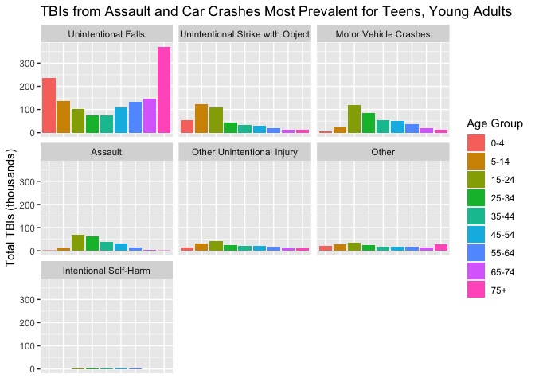
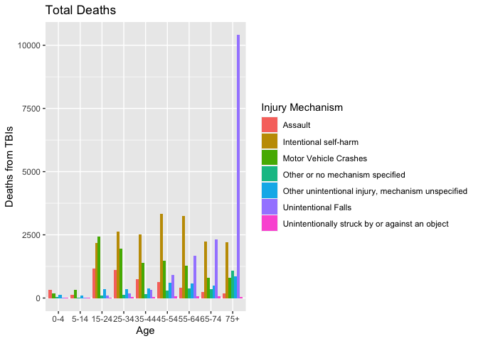
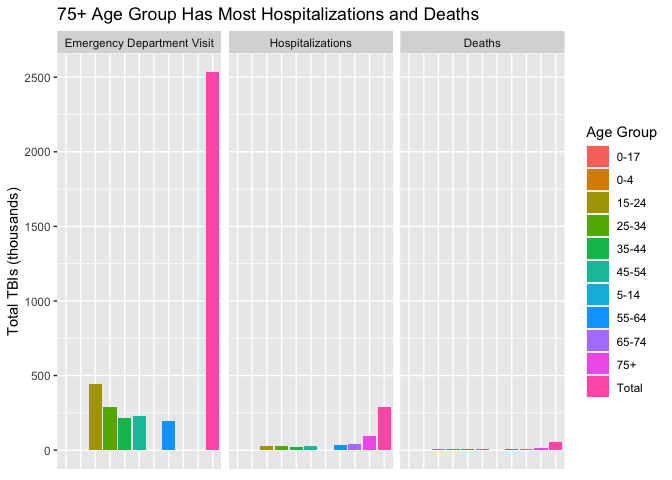

Traumatic Brain Injury Trends
================
Charlie Farison
2020-08-05

  - [Background](#background)
  - [Data Dictionaries](#data-dictionaries)
  - [Initial Data Exploration](#initial-data-exploration)

*Purpose*: We’d like to understand trends in causes of traumatic brain
injury.

# Background

<!-- -------------------------------------------------- -->

Brain Injury Awareness Month, observed each March, was established 3
decades ago to educate the public about the incidence of brain injury
and the needs of persons with brain injuries and their families. Caused
by a bump, blow, or jolt to the head, or penetrating head injury, a
traumatic brain injury (TBI) can lead to short- or long-term changes
affecting thinking, sensation, language, or emotion.

TBI is very common. One of every 60 people in the U.S. lives with a TBI
related disability. Moderate and severe traumatic brain injury (TBI) can
lead to a lifetime of physical, cognitive, emotional, and behavioral
changes.

**Sources:**

  - CDC: <https://www.cdc.gov/mmwr/volumes/68/wr/mm6810a1.htm>
  - TidyTuesday:
    <https://github.com/rfordatascience/tidytuesday/blob/master/data/2020/2020-03-24/readme.md>

# Data Dictionaries

<!-- -------------------------------------------------- -->

**tbi\_age**

| Variable          | Class     | Description                      |
| ----------------- | --------- | -------------------------------- |
| age\_group        | character | Age group                        |
| type              | character | Type of measure                  |
| injury\_mechanism | character | Injury mechanism                 |
| number\_est       | double    | Estimated observed cases in 2014 |
| rate\_est         | double    | Rate/100,000 in 2014             |

**tbi\_year**

| Variable          | Class     | Description                           |
| ----------------- | --------- | ------------------------------------- |
| injury\_mechanism | character | Injury mechanism                      |
| type              | character | Type of measure                       |
| year              | character | Year (2006 - 2014)                    |
| rate\_est         | double    | Rate/100,000 in 2014                  |
| number\_est       | integer   | Estimated observed cases in each year |

type has 3 possible values:

  - Emergency Department Visit  
  - Hospitalizations  
  - Deaths

injury\_mechanism has 7 possible values:

  - Motor Vehicle Crashes  
  - Unintentional Falls  
  - Unintentionally struck by or against an object  
  - Other unintentional injury, mechanism unspecified  
  - Intentional self-harm  
  - Assault  
  - Other or no mechanism specified

**tbi\_military**

| Variable  | Class     | Description                                 |
| --------- | --------- | ------------------------------------------- |
| service   | character | Military branch                             |
| component | character | Military component (active, guard, reserve) |
| severity  | character | Severity/type of TBI                        |
| diagnosed | double    | Number diagnosed                            |
| year      | integer   | Year for observation (2006 - 2014)          |

service has 4 possible values:

  - Army  
  - Navy  
  - Air Force  
  - Marines

component has 3 possible values:

  - Active  
  - Guard  
  - Reserve

severity has 5 possible values:

  - Penetrating  
  - Severe  
  - Moderate  
  - Mild  
  - Not Classifiable

# Initial Data Exploration

<!-- -------------------------------------------------- -->

*Questions to explore:*

  - What is the most common injury mechanism? Has that changed over
    time?
  - Does the most common injury mechanism vary by age group?
  - Do certain type of measures correlate with certain injury
    mechanisms?
  - Do certain type of measures correlate with certain ages?
  - Which service in the military has the highest rate of TBI? Has that
    changed over time?
  - Which component of the military has the highest rate of TBIs? Does
    it vary by service or over time?
  - Which service in the military has the most severe TBIs? Has that
    changed over time?

<!-- end list -->

``` r
tbi_summary <-
  tbi_year %>%
  mutate(year = as.integer(year)) %>%
  group_by(year, injury_mechanism) %>%
  summarize(total = sum(number_est)) %>%
  filter(total > 0) %>%
  mutate(total = total / 1000)
```

    ## `summarise()` regrouping output by 'year' (override with `.groups` argument)

``` r
tbi_summary %>%
  ggplot(mapping = aes(x = year, y = total, color = injury_mechanism)) +
  geom_point() +
  geom_line() +
  scale_color_discrete(name = "Injury Mechanism") +
  labs(
    title = "Increase in TBIs from Unintentional Falls",
    x = "Year",
    y = "Total TBIs (thousands)"
  )
```

<!-- -->

**Observations**:

  - Total traumatic brain injuries (TBIs) reported from unintentional
    falls nearly doubled from 2006 to 2014, while TBIs from people
    unintentionally struck by or against an object raised somewhat, and
    TBIs from other injury mechanisms stayed roughly constant. While
    population did increase, population did not double in this
    timeframe, so there is still a significant effect here. It is
    possible that some factor led to more reporting of TBIs, possibly
    increased awareness among medical professionals.

<!-- end list -->

``` r
age_summary <-
  tbi_age %>%
  group_by(age_group, injury_mechanism) %>%
  summarize(total = sum(number_est), total_rate = sum(rate_est)) %>%
  filter(total > 0, age_group != "0-17", age_group !="Total")
```

    ## `summarise()` regrouping output by 'age_group' (override with `.groups` argument)

``` r
age_summary$age_group <- 
  factor(
    age_summary$age_group,
    levels = c("0-4","5-14","15-24","25-34","35-44","45-54","55-64","65-74","75+"))
age_summary %>%
  filter(injury_mechanism %in% c("Unintentional Falls")) %>%
  mutate(total = total/1000) %>%
  ggplot() +
  geom_col(
    mapping = aes(x = age_group, y = total),
    position = "dodge") +
  labs(
    title = "TBIs from Unintentional Falls Most Prevalent for Adults 75+",
    x = "Age Group",
    y = "Total TBIs (thousands)"
  )
```

<!-- -->

**Observations**:

  - Diving deeper into 2014 data, the age group with the highest
    incidence of unintentional falls are 75+, followed by 0-4. So maybe
    the increase in unintentional falls is due to older people living
    longer and thus there being more older people who may have
    unintentional falls.

<!-- end list -->

``` r
age_summary_renamed <-
  age_summary %>%
  mutate(total = total/1000) %>%
  mutate(injury_mechanism = ifelse(
    injury_mechanism == "Unintentionally struck by or against an object", 
    "Unintentional Strike with Object",
    injury_mechanism)) %>%
  mutate(injury_mechanism = ifelse(
    injury_mechanism == "Other unintentional injury, mechanism unspecified", 
    "Other Unintentional Injury",
    injury_mechanism)) %>%
  mutate(injury_mechanism = ifelse(
    injury_mechanism == "Other or no mechanism specified", 
    "Other",
    injury_mechanism)) %>%
  mutate(injury_mechanism = ifelse(
    injury_mechanism == "Intentional self-harm", 
    "Intentional Self-Harm",
    injury_mechanism))
age_summary_renamed
```

    ## # A tibble: 59 x 4
    ## # Groups:   age_group [9]
    ##    age_group injury_mechanism                  total total_rate
    ##    <fct>     <chr>                             <dbl>      <dbl>
    ##  1 0-4       Assault                            1.96        9.8
    ##  2 0-4       Motor Vehicle Crashes              6.52       32.8
    ##  3 0-4       Other                             20.5       103. 
    ##  4 0-4       Other Unintentional Injury        12.9        65  
    ##  5 0-4       Unintentional Falls              235.       1185. 
    ##  6 0-4       Unintentional Strike with Object  54.0       272. 
    ##  7 15-24     Assault                           69.7       159. 
    ##  8 15-24     Intentional Self-Harm              3.32        7.5
    ##  9 15-24     Motor Vehicle Crashes            119.        271. 
    ## 10 15-24     Other                             35.5        80.9
    ## # … with 49 more rows

``` r
age_summary_renamed$injury_mechanism <- 
  factor(
    age_summary_renamed$injury_mechanism,
    levels = c(
      "Unintentional Falls",
      "Unintentional Strike with Object",
      "Motor Vehicle Crashes",
      "Assault",
      "Other Unintentional Injury",
      "Other",
      "Intentional Self-Harm"))
age_summary_renamed %>%
  ggplot() +
  geom_col(
    mapping = aes(x = age_group, y = total, fill = age_group), 
    position = "dodge") +
  scale_fill_discrete(name = "Age Group") +
  theme(
    axis.title.x =  element_blank(),
    axis.text.x = element_blank(),
    axis.ticks.x = element_blank()
    ) +
  facet_wrap(~injury_mechanism) +
  labs(
    title = "TBIs from Assault and Car Crashes Most Prevalent for Teens, Young Adults",
    x = "Age Group",
    y = "Total TBIs (thousands)"
  ) 
```

<!-- -->

**Observations**:

  - While unintentional falls are most common for the age group of 75+
    and the second most common age group is 0-4, with the age groups in
    the middle having the fewest, none of the other causes of TBIs share
    this pattern. In fact, Motor Vehicle Crashes and Assault share a
    general pattern of being most common for the age group of 15-24 and
    the total decreases for each ascending age group.

<!-- end list -->

``` r
age_summary_deaths <-
  tbi_age %>%
  filter(type == "Deaths") %>%
  filter(number_est > 0, age_group != "0-17", age_group !="Total")
age_summary_deaths$age_group <- 
  factor(
    age_summary_deaths$age_group,
    levels = c("0-4","5-14","15-24","25-34","35-44","45-54","55-64","65-74","75+"))
age_summary_deaths %>%
  ggplot() +
  geom_col(mapping = aes(x = age_group, y = number_est, fill = injury_mechanism), position = "dodge") +
  scale_fill_discrete(name = "Injury Mechanism") +
  labs(
    title = "Total Deaths",
    x = "Age",
    y = "Deaths from TBIs"
  )
```

<!-- -->

**Observations**:

  - Unintentional falls for the 75+ age group was also the leading cause
    of TBI-related deaths in 2014. Intentional self-harm was a distant
    second for most common cause of deaths, and was significant for all
    age groups upward of 15 years old. TBIs from Motor Vehicle Crashes
    was the third most signifi cant cause of death.
  - While looking at number of TBIs from unintentional falls, the 0-4
    age group was the second highest age group, deaths from TBIs from
    unintentional falls was minimal, dwarfed by deaths by assault.
    Overall deaths from TBIs for the 0-4 age group were very low.

<!-- end list -->

``` r
tbi_age
```

    ## # A tibble: 231 x 5
    ##    age_group type            injury_mechanism                number_est rate_est
    ##    <chr>     <chr>           <chr>                                <dbl>    <dbl>
    ##  1 0-17      Emergency Depa… Motor Vehicle Crashes                47138     64.1
    ##  2 0-17      Emergency Depa… Unintentional Falls                 397190    540. 
    ##  3 0-17      Emergency Depa… Unintentionally struck by or a…     229236    312. 
    ##  4 0-17      Emergency Depa… Other unintentional injury, me…      55785     75.8
    ##  5 0-17      Emergency Depa… Intentional self-harm                   NA     NA  
    ##  6 0-17      Emergency Depa… Assault                              24360     33.1
    ##  7 0-17      Emergency Depa… Other or no mechanism specified      57983     78.8
    ##  8 0-4       Emergency Depa… Motor Vehicle Crashes                 5464     27.5
    ##  9 0-4       Emergency Depa… Unintentional Falls                 230776   1161  
    ## 10 0-4       Emergency Depa… Unintentionally struck by or a…      53436    269. 
    ## # … with 221 more rows

``` r
age_summary_type <-
  tbi_age %>%
  group_by(age_group, type) %>%
  summarize(total = sum(number_est)/1000) #%>%
```

    ## `summarise()` regrouping output by 'age_group' (override with `.groups` argument)

``` r
  #filter(total > 0, age_group != "0-17", age_group !="Total")# %>%
  #filter(type %in% c("Hospitalizations", "Deaths"))

age_summary_type
```

    ## # A tibble: 33 x 3
    ## # Groups:   age_group [11]
    ##    age_group type                        total
    ##    <chr>     <chr>                       <dbl>
    ##  1 0-17      Deaths                      NA   
    ##  2 0-17      Emergency Department Visit  NA   
    ##  3 0-17      Hospitalizations            NA   
    ##  4 0-4       Deaths                      NA   
    ##  5 0-4       Emergency Department Visit  NA   
    ##  6 0-4       Hospitalizations            NA   
    ##  7 15-24     Deaths                       6.31
    ##  8 15-24     Emergency Department Visit 444.  
    ##  9 15-24     Hospitalizations            26.4 
    ## 10 25-34     Deaths                       6.37
    ## # … with 23 more rows

``` r
age_summary_type$type <- 
  factor(
    age_summary_type$type,
    levels = c("Emergency Department Visit", "Hospitalizations", "Deaths"))

age_summary_type %>%
  ggplot() +
  geom_col(
    mapping = aes(x = age_group, y = total, fill = age_group), 
    position = "dodge") +
  scale_fill_discrete(name = "Age Group") +
  theme(
    axis.title.x =  element_blank(),
    axis.text.x = element_blank(),
    axis.ticks.x = element_blank()
    ) +
  facet_wrap(~type) +
  labs(
    title = "75+ Age Group Has Most Hospitalizations and Deaths",
    x = "Age Group",
    y = "Total TBIs (thousands)"
  ) 
```

    ## Warning: Removed 11 rows containing missing values (geom_col).

<!-- -->

**Observations**:

  - The 75+ age group has the highest hospitalizations and deaths. It
    was unclear if they also have the most emergency room visits,
    because 75+ and 65-74 age groups had N/A listed for this dataset.
