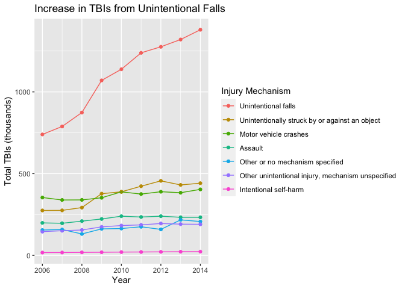
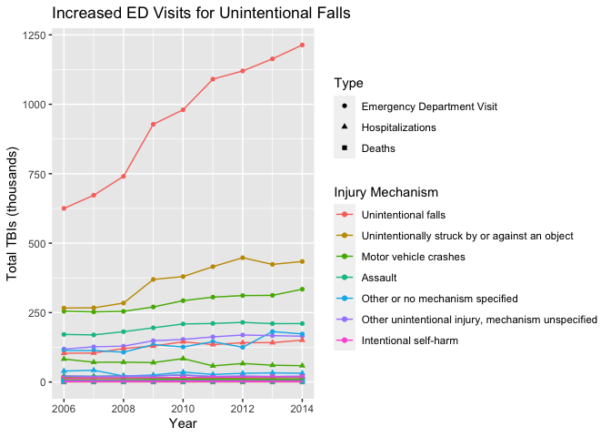
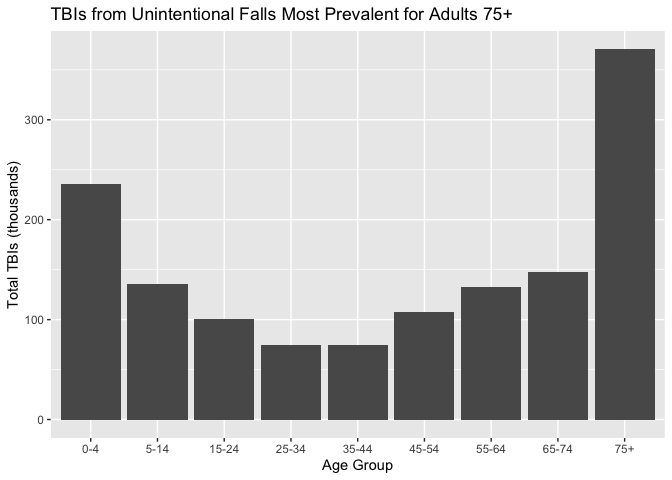
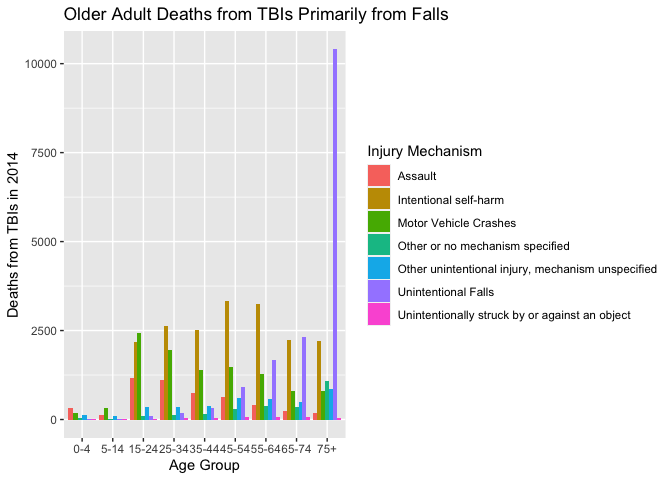

Traumatic Brain Injury Trends
================
Charlie Farison
2020-08-05

  - [Background](#background)
  - [Data Dictionaries](#data-dictionaries)
  - [Data Background](#data-background)
  - [Data Ingestion](#data-ingestion)
  - [Findings](#findings)

*Purpose*: We’d like to understand trends in causes of traumatic brain
injury.

# Background

<!-- -------------------------------------------------- -->

Brain Injury Awareness Month, observed each March, was established 3
decades ago to educate the public about the incidence of brain injury
and the needs of persons with brain injuries and their families. Caused
by a bump, blow, or jolt to the head, or penetrating head injury, a
traumatic brain injury (TBI) can lead to short- or long-term changes
affecting thinking, sensation, language, or emotion.

TBI is very common. One of every 60 people in the U.S. lives with a TBI
related disability. Moderate and severe traumatic brain injury (TBI) can
lead to a lifetime of physical, cognitive, emotional, and behavioral
changes.

**Sources:**

  - CDC: <https://www.cdc.gov/mmwr/volumes/68/wr/mm6810a1.htm>
  - TidyTuesday:
    <https://github.com/rfordatascience/tidytuesday/blob/master/data/2020/2020-03-24/readme.md>

# Data Dictionaries

<!-- -------------------------------------------------- -->

**tbi\_age**

| Variable          | Class     | Description                      |
| ----------------- | --------- | -------------------------------- |
| age\_group        | character | Age group                        |
| type              | character | Type of measure                  |
| injury\_mechanism | character | Injury mechanism                 |
| number\_est       | double    | Estimated observed cases in 2014 |
| rate\_est         | double    | Rate/100,000 in 2014             |

**tbi\_year**

| Variable          | Class     | Description                           |
| ----------------- | --------- | ------------------------------------- |
| injury\_mechanism | character | Injury mechanism                      |
| type              | character | Type of measure                       |
| year              | character | Year (2006 - 2014)                    |
| rate\_est         | double    | Rate/100,000 in 2014                  |
| number\_est       | integer   | Estimated observed cases in each year |

type has 3 possible values:

  - Emergency Department Visit  
  - Hospitalizations  
  - Deaths

injury\_mechanism has 7 possible values:

  - Motor Vehicle Crashes  
  - Unintentional Falls  
  - Unintentionally struck by or against an object  
  - Other unintentional injury, mechanism unspecified  
  - Intentional self-harm  
  - Assault  
  - Other or no mechanism specified

# Data Background

  - This data set comes from the CDC.
  - Because all of the TBIs in this dataset are recorded with type of
    either Emergency Department Visit, Hospitalization, or Deaths, I
    assume that only TBIs that result in one of these 3 outcomes are
    present in this data set.
  - Less severe TBIs that do not require Emergency Department Visit or
    Hospitalization and do not result in death are not reported.
  - This data is likely aggregated from many different hospitals, so its
    completeness is uncertain.
  - Population increased year over year, but the data set offers a
    normalized option of rate\_est.

# Data Ingestion

<!-- -------------------------------------------------- -->

# Findings

<!-- -------------------------------------------------- -->

*A Marked Increase* - The traumatic brain injuries reported in this
dataset increased dramatically from 2006 to 2014, primarily due to a
nearly twofold increase in unintentional falls.

``` r
library(tidyverse)
```

    ## ── Attaching packages ────────────────────────────────────────────────────────── tidyverse 1.3.0 ──

    ## ✓ ggplot2 3.3.2     ✓ purrr   0.3.4
    ## ✓ tibble  3.0.1     ✓ dplyr   1.0.0
    ## ✓ tidyr   1.1.0     ✓ stringr 1.4.0
    ## ✓ readr   1.3.1     ✓ forcats 0.5.0

    ## ── Conflicts ───────────────────────────────────────────────────────────── tidyverse_conflicts() ──
    ## x dplyr::filter() masks stats::filter()
    ## x dplyr::lag()    masks stats::lag()

``` r
tbi_summary <-
  tbi_year %>%
  mutate(year = as.integer(year)) %>%
  group_by(year, injury_mechanism) %>%
  summarize(total = sum(number_est)/1000) %>%
  filter(total > 0) %>%
  mutate(total = total)
```

    ## `summarise()` regrouping output by 'year' (override with `.groups` argument)

``` r
tbi_summary %>%
  ggplot(mapping = aes(x = year, y = total, color = injury_mechanism)) +
  geom_point() +
  geom_line() +
  scale_color_discrete(name = "Injury Mechanism") +
  labs(
    title = "Increase in TBIs from Unintentional Falls",
    x = "Year",
    y = "Total TBIs (thousands)"
  )
```

<!-- -->

**Observations**:

  - Total traumatic brain injuries (TBIs) reported from unintentional
    falls nearly doubled from 2006 to 2014, while TBIs from people
    unintentionally struck by or against an object raised somewhat, and
    TBIs from other injury mechanisms stayed roughly constant.
  - Some of the increase could be due to population increase. This
    dataset initially looks to offer a normalized variable of rate\_est
    that is per 100,000 people, but it says “per 100,000 people in
    2014”, so it is unclear whether using that variable would factor
    in year over year population increases.
  - It is possible that some factor led to more reporting of TBIs,
    possibly increased awareness among medical professionals.

*Why So Many More TBIs Reported?*

  - This dataset cannot directly answer the question of why so many more
    truamatic brain injuries for older adults were reported in 2014 than
    in 2006, but I have some theories. Here I looked into reports by
    type.

<!-- end list -->

``` r
tbi_year %>%
  filter(injury_mechanism != "Total") %>%
  ggplot(mapping = aes(x = year, y = number_est, color = injury_mechanism, shape = type)) +
  geom_point() +
  geom_line()
```

<!-- -->

**Observations**:

  - This graph shows that the increase in total TBIs from unintentional
    falls in this dataset was primarily from Emergency Department
    visits. So the increase could be due to more Emergency Departments
    being added to the dataset, or more awareness of TBI in Emergency
    Departments leading to more classification of TBI in their data. It
    could also be due to an actual increase in unintentional falls, but
    it is unclear what would cause such an increase.

*Older Adults Most Affected* - Based on 2014 age group data, traumatic
brain injuries from unintentional falls primarily affect adults 75+,
with children age 0-4 as the next most impacted group.

``` r
age_summary <-
  tbi_age %>%
  group_by(age_group, injury_mechanism) %>%
  summarize(total = sum(number_est), total_rate = sum(rate_est)) %>%
  filter(total > 0, age_group != "0-17", age_group !="Total")
```

    ## `summarise()` regrouping output by 'age_group' (override with `.groups` argument)

``` r
age_summary$age_group <- 
  factor(
    age_summary$age_group,
    levels = c("0-4","5-14","15-24","25-34","35-44","45-54","55-64","65-74","75+"))
age_summary %>%
  filter(injury_mechanism %in% c("Unintentional Falls")) %>%
  mutate(total = total/1000) %>%
  ggplot() +
  geom_col(
    mapping = aes(x = age_group, y = total),
    position = "dodge") +
  labs(
    title = "TBIs from Unintentional Falls Most Prevalent for Adults 75+",
    x = "Age Group",
    y = "Total TBIs (thousands)"
  )
```

<!-- -->

**Observations**:

  - Diving deeper into 2014 data, the age group with the highest
    incidence of unintentional falls are 75+, followed by 0-4. So maybe
    the increase in unintentional falls is due to older people living
    longer and thus there being more older people who may have
    unintentional falls. This data set does not enable exploring how
    many more older adults there were in 2014 than 2006, but it can’t
    possibly be an almost twofold increase.

*TBIs from Unintentional Falls More Fatal for Older Adults* Deaths from
TBIs also primarily impacts older adults, and unintentional falls is a
leading cause.

``` r
age_summary_deaths <-
  tbi_age %>%
  filter(type == "Deaths") %>%
  filter(number_est > 0, age_group != "0-17", age_group !="Total")
age_summary_deaths$age_group <- 
  factor(
    age_summary_deaths$age_group,
    levels = c("0-4","5-14","15-24","25-34","35-44","45-54","55-64","65-74","75+"))
age_summary_deaths %>%
  ggplot() +
  geom_col(mapping = aes(x = age_group, y = number_est, fill = injury_mechanism), position = "dodge") +
  scale_fill_discrete(name = "Injury Mechanism") +
  labs(
    title = "Older Adult Deaths from TBIs Primarily from Falls",
    x = "Age Group",
    y = "Deaths from TBIs in 2014"
  )
```

<!-- -->

**Observations**:

  - While there are many children ages 0-4 with traumatic brain injuries
    from falls who have emergency department visits or hospitalizations,
    deaths from traumatic brain injuries from falls is much more
    commonly reported for the older adults. While for children age 0-4
    traumatic brain injuries are most commonly caused by unintentional
    falls, deaths for children age 0-4 from traumatic brain injury are
    much more likely to be from assault or motor vehicle crashes.

*Summary*

Reported TBIs in this dataset increased by nearly a factor of 2 from
2006 to 2014. The increase was primarily due to emergency department
visits by adults age 75+ after an unintentional fall. This marked
increase cannot be due to older adult population increase alone, and it
seems so striking an increase that it makes me wonder if the data being
aggregated changed significantly from 2006 to 2014, for example it’s
possible that more hospitals’ data got added to the data set, or
emergency departments changed how they were categorizing injuries to
start reporting more TBIs.
