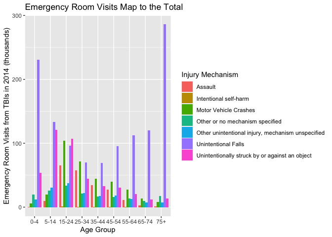

Traumatic Brain Injury Trends
================
Charlie Farison
2020-08-05

  - [Background](#background)
  - [Data Dictionaries](#data-dictionaries)
  - [Data Background](#data-background)
  - [Data Ingestion](#data-ingestion)
  - [Findings](#findings)

*Purpose*: We’d like to understand trends in causes of traumatic brain
injury.

# Background

<!-- -------------------------------------------------- -->

Brain Injury Awareness Month, observed each March, was established 3
decades ago to educate the public about the incidence of brain injury
and the needs of persons with brain injuries and their families. Caused
by a bump, blow, or jolt to the head, or penetrating head injury, a
traumatic brain injury (TBI) can lead to short- or long-term changes
affecting thinking, sensation, language, or emotion.

TBI is very common. One of every 60 people in the U.S. lives with a TBI
related disability. Moderate and severe traumatic brain injury (TBI) can
lead to a lifetime of physical, cognitive, emotional, and behavioral
changes.

**Sources:**

  - CDC: <https://www.cdc.gov/mmwr/volumes/68/wr/mm6810a1.htm>
  - TidyTuesday:
    <https://github.com/rfordatascience/tidytuesday/blob/master/data/2020/2020-03-24/readme.md>

# Data Dictionaries

<!-- -------------------------------------------------- -->

**tbi\_age**

| Variable          | Class     | Description                      |
| ----------------- | --------- | -------------------------------- |
| age\_group        | character | Age group                        |
| type              | character | Type of measure                  |
| injury\_mechanism | character | Injury mechanism                 |
| number\_est       | double    | Estimated observed cases in 2014 |
| rate\_est         | double    | Rate/100,000 in 2014             |

**tbi\_year**

| Variable          | Class     | Description                           |
| ----------------- | --------- | ------------------------------------- |
| injury\_mechanism | character | Injury mechanism                      |
| type              | character | Type of measure                       |
| year              | character | Year (2006 - 2014)                    |
| rate\_est         | double    | Rate/100,000 in 2014                  |
| number\_est       | integer   | Estimated observed cases in each year |

type has 3 possible values:

  - Emergency Department Visit  
  - Hospitalizations  
  - Deaths

injury\_mechanism has 7 possible values:

  - Motor Vehicle Crashes  
  - Unintentional Falls  
  - Unintentionally struck by or against an object  
  - Other unintentional injury, mechanism unspecified  
  - Intentional self-harm  
  - Assault  
  - Other or no mechanism specified

# Data Background

  - This data set comes from the CDC.
  - Because all of the TBIs in this dataset are recorded with type of
    either Emergency Department Visit, Hospitalization, or Deaths, I
    assume that only TBIs that result in one of these 3 outcomes are
    present in this data set.
  - Less severe TBIs that do not require Emergency Department Visit or
    Hospitalization and do not result in death are not reported.
  - This data is likely aggregated from many different hospitals, so its
    completeness is uncertain.

# Data Ingestion

<!-- -------------------------------------------------- -->

# Findings

<!-- -------------------------------------------------- -->

*A Marked Increase* - The traumatic brain injuries reported in this
dataset increased dramatically from 2006 to 2014, primarily due to a
nearly twofold increase in unintentional falls. (The dramatic increase
came primarily from the following type…)

``` r
library(tidyverse)
```

    ## ── Attaching packages ────────────────────────────────────────────────────────── tidyverse 1.3.0 ──

    ## ✓ ggplot2 3.3.2     ✓ purrr   0.3.4
    ## ✓ tibble  3.0.1     ✓ dplyr   1.0.0
    ## ✓ tidyr   1.1.0     ✓ stringr 1.4.0
    ## ✓ readr   1.3.1     ✓ forcats 0.5.0

    ## ── Conflicts ───────────────────────────────────────────────────────────── tidyverse_conflicts() ──
    ## x dplyr::filter() masks stats::filter()
    ## x dplyr::lag()    masks stats::lag()

``` r
tbi_summary <-
  tbi_year %>%
  mutate(year = as.integer(year)) %>%
  group_by(year, injury_mechanism) %>%
  summarize(total = sum(number_est)) %>%
  filter(total > 0) %>%
  mutate(total = total / 1000)
```

    ## `summarise()` regrouping output by 'year' (override with `.groups` argument)

``` r
tbi_summary %>%
  ggplot(mapping = aes(x = year, y = total, color = injury_mechanism)) +
  geom_point() +
  geom_line() +
  scale_color_discrete(name = "Injury Mechanism") +
  labs(
    title = "Increase in TBIs from Unintentional Falls",
    x = "Year",
    y = "Total TBIs (thousands)"
  )
```

<!-- -->

**Observations**:

  - Total traumatic brain injuries (TBIs) reported from unintentional
    falls nearly doubled from 2006 to 2014, while TBIs from people
    unintentionally struck by or against an object raised somewhat, and
    TBIs from other injury mechanisms stayed roughly constant. While
    population did increase, population did not double in this
    timeframe, so there is still a significant effect here. It is
    possible that some factor led to more reporting of TBIs, possibly
    increased awareness among medical professionals.

*Older Adults Most Affected* - Based on 2014 age group data, traumatic
brain injuries from unintentional falls primarily affect adults 75+,
with children age 0-4 as the next most impacted group.

``` r
age_summary <-
  tbi_age %>%
  group_by(age_group, injury_mechanism) %>%
  summarize(total = sum(number_est), total_rate = sum(rate_est)) %>%
  filter(total > 0, age_group != "0-17", age_group !="Total")
```

    ## `summarise()` regrouping output by 'age_group' (override with `.groups` argument)

``` r
age_summary$age_group <- 
  factor(
    age_summary$age_group,
    levels = c("0-4","5-14","15-24","25-34","35-44","45-54","55-64","65-74","75+"))
age_summary %>%
  filter(injury_mechanism %in% c("Unintentional Falls")) %>%
  mutate(total = total/1000) %>%
  ggplot() +
  geom_col(
    mapping = aes(x = age_group, y = total),
    position = "dodge") +
  labs(
    title = "TBIs from Unintentional Falls Most Prevalent for Adults 75+",
    x = "Age Group",
    y = "Total TBIs (thousands)"
  )
```

<!-- -->

**Observations**:

  - Diving deeper into 2014 data, the age group with the highest
    incidence of unintentional falls are 75+, followed by 0-4. So maybe
    the increase in unintentional falls is due to older people living
    longer and thus there being more older people who may have
    unintentional falls.

*Why So Many More TBIs Reported?*

  - This dataset cannot directly answer the question of why so many more
    truamatic brain injuries for older adults were reported in 2014 than
    in 2006, but I have some theories. Here I looked into reports by
    type.

<!-- end list -->

``` r
tbi_year %>%
  filter(injury_mechanism != "Total") %>%
  ggplot(mapping = aes(x = year, y = rate_est, color = injury_mechanism, shape = type)) +
  geom_point() +
  geom_line()
```

<!-- -->

*TBIs from Unintentional Falls More Fatal for Older Adults* - While
there are many children ages 0-4 with traumatic brain injuries from
falls who have emergency department visits or hospitalizations, deaths
from traumatic brain injuries from falls is much more commonly reported
for the older adults. While for children age 0-4 traumatic brain
injuries are most commonly caused by unintentional falls, deaths for
children age 0-4 from traumatic brain injury are much more likely to be
from assault or motor vehicle crashes.

``` r
age_summary_deaths <-
  tbi_age %>%
  filter(type == "Deaths") %>%
  filter(number_est > 0, age_group != "0-17", age_group !="Total")
age_summary_deaths$age_group <- 
  factor(
    age_summary_deaths$age_group,
    levels = c("0-4","5-14","15-24","25-34","35-44","45-54","55-64","65-74","75+"))
age_summary_deaths %>%
  ggplot() +
  geom_col(mapping = aes(x = age_group, y = number_est, fill = injury_mechanism), position = "dodge") +
  scale_fill_discrete(name = "Injury Mechanism") +
  labs(
    title = "Older Adult Deaths from TBIs Primarily from Falls",
    x = "Age Group",
    y = "Deaths from TBIs in 2014"
  )
```

<!-- -->

**Observations**:

  - Unintentional falls for the 75+ age group was also the leading cause
    of TBI-related deaths in 2014. Intentional self-harm was a distant
    second for most common cause of deaths, and was significant for all
    age groups upward of 15 years old. TBIs from Motor Vehicle Crashes
    was the third most significant cause of death.
  - While looking at number of TBIs from unintentional falls, the 0-4
    age group was the second highest age group, deaths from TBIs from
    unintentional falls was minimal, dwarfed by deaths by assault.
    Overall deaths from TBIs for the 0-4 age group were very low.

<!-- end list -->

``` r
age_summary_ed <-
  tbi_age %>%
  filter(type == "Emergency Department Visit") %>%
  filter(number_est > 0, age_group != "0-17", age_group !="Total") %>%
  mutate(thousands = number_est/1000)
age_summary_ed
```

    ## # A tibble: 59 x 6
    ##    age_group type        injury_mechanism          number_est rate_est thousands
    ##    <chr>     <chr>       <chr>                          <dbl>    <dbl>     <dbl>
    ##  1 0-4       Emergency … Motor Vehicle Crashes           5464     27.5     5.46 
    ##  2 0-4       Emergency … Unintentional Falls           230776   1161     231.   
    ##  3 0-4       Emergency … Unintentionally struck b…      53436    269.     53.4  
    ##  4 0-4       Emergency … Other unintentional inju…      12007     60.4    12.0  
    ##  5 0-4       Emergency … Assault                          674      3.4     0.674
    ##  6 0-4       Emergency … Other or no mechanism sp…      19360     97.4    19.4  
    ##  7 5-14      Emergency … Motor Vehicle Crashes          19785     48      19.8  
    ##  8 5-14      Emergency … Unintentional Falls           133084    323.    133.   
    ##  9 5-14      Emergency … Unintentionally struck b…     120839    293.    121.   
    ## 10 5-14      Emergency … Other unintentional inju…      30656     74.4    30.7  
    ## # … with 49 more rows

``` r
age_summary_ed$age_group <- 
  factor(
    age_summary_ed$age_group,
    levels = c("0-4","5-14","15-24","25-34","35-44","45-54","55-64","65-74","75+"))
age_summary_ed %>%
  ggplot() +
  geom_col(mapping = aes(x = age_group, y = thousands, fill = injury_mechanism), position = "dodge") +
  scale_fill_discrete(name = "Injury Mechanism") +
  labs(
    title = "Emergency Room Visits Map to the Total",
    x = "Age Group",
    y = "Emergency Room Visits from TBIs in 2014 (thousands)"
  )
```

<!-- -->

**Observations**:

  - Emergency Room Visits map to the total.

<!-- end list -->

``` r
age_summary_renamed <-
  age_summary %>%
  mutate(total = total/1000) %>%
  mutate(injury_mechanism = ifelse(
    injury_mechanism == "Unintentionally struck by or against an object", 
    "Unintentional Strike with Object",
    injury_mechanism)) %>%
  mutate(injury_mechanism = ifelse(
    injury_mechanism == "Other unintentional injury, mechanism unspecified", 
    "Other Unintentional Injury",
    injury_mechanism)) %>%
  mutate(injury_mechanism = ifelse(
    injury_mechanism == "Other or no mechanism specified", 
    "Other",
    injury_mechanism)) %>%
  mutate(injury_mechanism = ifelse(
    injury_mechanism == "Intentional self-harm", 
    "Intentional Self-Harm",
    injury_mechanism))
age_summary_renamed
```

    ## # A tibble: 59 x 4
    ## # Groups:   age_group [9]
    ##    age_group injury_mechanism                  total total_rate
    ##    <fct>     <chr>                             <dbl>      <dbl>
    ##  1 0-4       Assault                            1.96        9.8
    ##  2 0-4       Motor Vehicle Crashes              6.52       32.8
    ##  3 0-4       Other                             20.5       103. 
    ##  4 0-4       Other Unintentional Injury        12.9        65  
    ##  5 0-4       Unintentional Falls              235.       1185. 
    ##  6 0-4       Unintentional Strike with Object  54.0       272. 
    ##  7 15-24     Assault                           69.7       159. 
    ##  8 15-24     Intentional Self-Harm              3.32        7.5
    ##  9 15-24     Motor Vehicle Crashes            119.        271. 
    ## 10 15-24     Other                             35.5        80.9
    ## # … with 49 more rows

``` r
age_summary_renamed$injury_mechanism <- 
  factor(
    age_summary_renamed$injury_mechanism,
    levels = c(
      "Unintentional Falls",
      "Unintentional Strike with Object",
      "Motor Vehicle Crashes",
      "Assault",
      "Other Unintentional Injury",
      "Other",
      "Intentional Self-Harm"))
age_summary_renamed %>%
  ggplot() +
  geom_col(
    mapping = aes(x = age_group, y = total, fill = age_group), 
    position = "dodge") +
  scale_fill_discrete(name = "Age Group") +
  theme(
    axis.title.x =  element_blank(),
    axis.text.x = element_blank(),
    axis.ticks.x = element_blank()
    ) +
  facet_wrap(~injury_mechanism) +
  labs(
    title = "TBIs from Assault and Car Crashes Most Prevalent for Teens, Young Adults",
    x = "Age Group",
    y = "Total TBIs (thousands)"
  ) 
```

<!-- -->

**Observations**:

  - While unintentional falls are most common for the age group of 75+
    and the second most common age group is 0-4, with the age groups in
    the middle having the fewest, none of the other causes of TBIs share
    this pattern. In fact, Motor Vehicle Crashes and Assault share a
    general pattern of being most common for the age group of 15-24 and
    the total decreases for each ascending age group.
