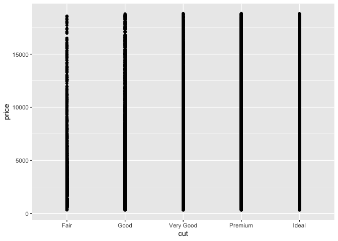
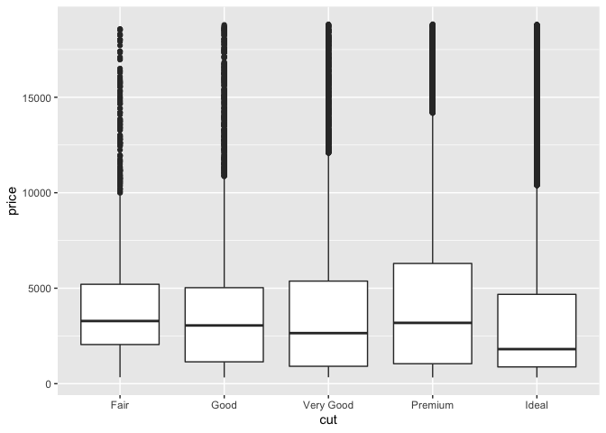
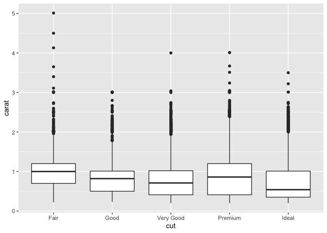

EDA Basics
================
2020-05-07

*Purpose*: *Exploratory Data Analysis* (EDA) is a **crucial** skill for
a practicing data scientist. Unfortunately, much like human-centered
design EDA is hard to teach. This is because EDA is **not** a strict
procedure, so much as it is a **mindset**. Also, much like
human-centered design, EDA is an *iterative, nonlinear process*. There
are two key principles to keep in mind when doing EDA:

  - 1.  Curiosity: Generate lots of ideas and hypotheses about your
        data.

  - 2.  Skepticism: Remain unconvinced of those ideas, unless you can
        find credible patterns to support them.

Since EDA is both *crucial* and *difficult*, we will practice doing EDA
*a lot* in this course\!

*Reading*: [Exploratory Data
Analysis](https://rstudio.cloud/learn/primers/3.1) *Topics*: (All
topics) *Reading Time*: \~45 minutes

*Note*: This exercise will consist of interpreting pre-made graphs. You
can run the whole notebook to generate all the figures at once. Just
make sure to do all the exercises and write your observations\!

``` r
library(tidyverse)
```

    ## ── Attaching packages ────────────────────────────────────────────────────────── tidyverse 1.3.0 ──

    ## ✓ ggplot2 3.3.2     ✓ purrr   0.3.4
    ## ✓ tibble  3.0.1     ✓ dplyr   1.0.0
    ## ✓ tidyr   1.1.0     ✓ stringr 1.4.0
    ## ✓ readr   1.3.1     ✓ forcats 0.5.0

    ## ── Conflicts ───────────────────────────────────────────────────────────── tidyverse_conflicts() ──
    ## x dplyr::filter() masks stats::filter()
    ## x dplyr::lag()    masks stats::lag()

**q0** Remember from `e02-data-basics` there were *simple checks* we’re
supposed to do? Do those simple checks on the diamonds dataset below.

``` r
head(diamonds)
```

    ## # A tibble: 6 x 10
    ##   carat cut       color clarity depth table price     x     y     z
    ##   <dbl> <ord>     <ord> <ord>   <dbl> <dbl> <int> <dbl> <dbl> <dbl>
    ## 1 0.23  Ideal     E     SI2      61.5    55   326  3.95  3.98  2.43
    ## 2 0.21  Premium   E     SI1      59.8    61   326  3.89  3.84  2.31
    ## 3 0.23  Good      E     VS1      56.9    65   327  4.05  4.07  2.31
    ## 4 0.290 Premium   I     VS2      62.4    58   334  4.2   4.23  2.63
    ## 5 0.31  Good      J     SI2      63.3    58   335  4.34  4.35  2.75
    ## 6 0.24  Very Good J     VVS2     62.8    57   336  3.94  3.96  2.48

``` r
glimpse(diamonds)
```

    ## Rows: 53,940
    ## Columns: 10
    ## $ carat   <dbl> 0.23, 0.21, 0.23, 0.29, 0.31, 0.24, 0.24, 0.26, 0.22, 0.23, 0…
    ## $ cut     <ord> Ideal, Premium, Good, Premium, Good, Very Good, Very Good, Ve…
    ## $ color   <ord> E, E, E, I, J, J, I, H, E, H, J, J, F, J, E, E, I, J, J, J, I…
    ## $ clarity <ord> SI2, SI1, VS1, VS2, SI2, VVS2, VVS1, SI1, VS2, VS1, SI1, VS1,…
    ## $ depth   <dbl> 61.5, 59.8, 56.9, 62.4, 63.3, 62.8, 62.3, 61.9, 65.1, 59.4, 6…
    ## $ table   <dbl> 55, 61, 65, 58, 58, 57, 57, 55, 61, 61, 55, 56, 61, 54, 62, 5…
    ## $ price   <int> 326, 326, 327, 334, 335, 336, 336, 337, 337, 338, 339, 340, 3…
    ## $ x       <dbl> 3.95, 3.89, 4.05, 4.20, 4.34, 3.94, 3.95, 4.07, 3.87, 4.00, 4…
    ## $ y       <dbl> 3.98, 3.84, 4.07, 4.23, 4.35, 3.96, 3.98, 4.11, 3.78, 4.05, 4…
    ## $ z       <dbl> 2.43, 2.31, 2.31, 2.63, 2.75, 2.48, 2.47, 2.53, 2.49, 2.39, 2…

``` r
summary(diamonds)
```

    ##      carat               cut        color        clarity          depth      
    ##  Min.   :0.2000   Fair     : 1610   D: 6775   SI1    :13065   Min.   :43.00  
    ##  1st Qu.:0.4000   Good     : 4906   E: 9797   VS2    :12258   1st Qu.:61.00  
    ##  Median :0.7000   Very Good:12082   F: 9542   SI2    : 9194   Median :61.80  
    ##  Mean   :0.7979   Premium  :13791   G:11292   VS1    : 8171   Mean   :61.75  
    ##  3rd Qu.:1.0400   Ideal    :21551   H: 8304   VVS2   : 5066   3rd Qu.:62.50  
    ##  Max.   :5.0100                     I: 5422   VVS1   : 3655   Max.   :79.00  
    ##                                     J: 2808   (Other): 2531                  
    ##      table           price             x                y         
    ##  Min.   :43.00   Min.   :  326   Min.   : 0.000   Min.   : 0.000  
    ##  1st Qu.:56.00   1st Qu.:  950   1st Qu.: 4.710   1st Qu.: 4.720  
    ##  Median :57.00   Median : 2401   Median : 5.700   Median : 5.710  
    ##  Mean   :57.46   Mean   : 3933   Mean   : 5.731   Mean   : 5.735  
    ##  3rd Qu.:59.00   3rd Qu.: 5324   3rd Qu.: 6.540   3rd Qu.: 6.540  
    ##  Max.   :95.00   Max.   :18823   Max.   :10.740   Max.   :58.900  
    ##                                                                   
    ##        z         
    ##  Min.   : 0.000  
    ##  1st Qu.: 2.910  
    ##  Median : 3.530  
    ##  Mean   : 3.539  
    ##  3rd Qu.: 4.040  
    ##  Max.   :31.800  
    ## 

I’m going to walk you through a train of thought I had when studying the
diamonds dataset.

There are four standard “C’s” of
[judging](https://en.wikipedia.org/wiki/Diamond_\(gemstone\)) a
diamond.\[1\] These are `carat, cut, color` and `clarity`, all of which
are in the `diamonds` dataset.

### Hypothesis 1

**Here’s a hypothesis**: `Ideal` is the “best” value of `cut` for a
diamond. Since an `Ideal` cut seems more labor-intensive, I hypothesize
that `Ideal` cut diamonds are less numerous than other cuts.

**q1** Run the chunk below, and study the plot. Was hypothesis 1
correct? Why or why not?

``` r
diamonds %>%
  ggplot(aes(cut)) +
  geom_bar()
```

<!-- -->

**Observations**: - Write your observations here\!

### Hypothesis 2

**Another hypothesis**: The `Ideal` cut diamonds should be the most
pricey.

**q2.1** Study the following graph; does it support, contradict, or not
relate to hypothesis 2?

*Hint*: Is this an effective graph? Why or why not?

``` r
diamonds %>%
  ggplot(aes(cut, price)) +
  geom_point()
```

<!-- -->

**Observations**: - Write your observations here\!

The following is a set of *boxplots*; the middle bar denotes the median,
the boxes denote the *quartiles* (upper and lower “quarters” of the
data), and the lines and dots denote large values and outliers.

**q2.2** Study the following graph; does it support or contradict
hypothesis 2?

``` r
diamonds %>%
  ggplot(aes(cut, price)) +
  geom_boxplot()
```

<!-- -->

**Observations**: - Write your observations here\!

### Unraveling Hypothesis 2

Upon making the graph in **q2.2**, I was very surprised. So I did some
reading on diamond cuts. It turns out that some gemcutters [sacrifice
cut for carat](https://en.wikipedia.org/wiki/Diamond_\(gemstone\)#Cut).
Could this effect explain the surprising pattern above?

**q3** Study the following graph; does it support a “carat over cut”
hypothesis? How might this relate to price?

*Hint*: The article linked above will help you answer these questions\!

``` r
diamonds %>%
  ggplot(aes(cut, carat)) +
  geom_boxplot()
```

<!-- -->

**Observations**: - Write your observations here\!

### Footnotes

\[1\] Don’t mistake my focus on `diamonds` as an endorsement of the
diamond industry. In my opinion aesthetic diamonds are a morally dubious
scam.

<!-- include-exit-ticket -->

# Exit Ticket

<!-- -------------------------------------------------- -->

Once you have completed this exercise, make sure to fill out the **exit
ticket survey**, [linked
here](https://docs.google.com/forms/d/e/1FAIpQLSeuq2LFIwWcm05e8-JU84A3irdEL7JkXhMq5Xtoalib36LFHw/viewform?usp=pp_url&entry.693978880=e-stat00-eda-basics-assignment.Rmd).
